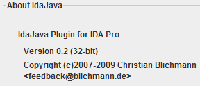
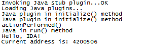
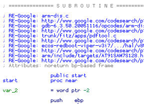
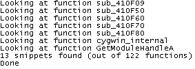
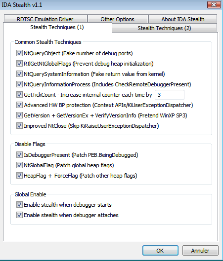
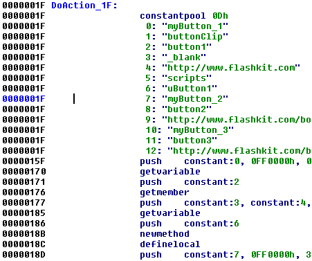
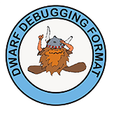
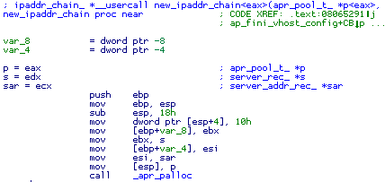
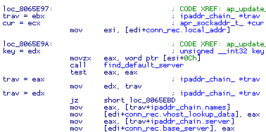
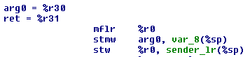

We are happy to announce the results of our first Hex-Rays plugin contest! The submitted files are very interesting. We are sure that you too will find them useful and increasing your productivity.

While we had no difficulties determining the first winner, the second place was not that obvious, both candidates were very good. In the end we did choose, but decided that the third place deserves the prize as well.

In fact, we feel that all submissions are good and deserve a prize, but the number of winning places is always limited. Probably we will be better prepared for the next time.

We would like to thank all participants for the submissions. Many of them show new ways of using and extending IDA. See below youself 😉

Without further ado, let us announce the winners. They are:

# IdaJava

**Christian Blichmann from [Zynamics](http://www.zynamics.com/) with the Java plugin**

 

The short description provided by the author:

[IdaJava is a plugin for IDA that allows to write IDA plugins in Java. In other words: IdaJava is to Java like IDAPython is to Python… The plugin creates an in-process Java VM and looks for JAR files in IDA’s plugins directory. Each Java based plugin gets their own menu item in Edit|Plugins.](PlugIn/README.txt)

**Our comments:** This looks like a very promising plugin. Java fans will finally be able to program for IDA in Java!

The plugin greeted us with:

Hello world from Java, nice to see you!

**Download link (OUTDATED):** [idajava.zip](PlugIn/idajava.zip)

**Direct link to project page:** [http://github.com/cblichmann/idajava](https://github.com/cblichmann/idajava)

# RE-Google

**Felix Leder from [University of Bonn](http://net.cs.uni-bonn.de/) 

with the Re-Google plugin** From the readme.txt file:

RE-Google is a plugin for the Interactive DisAssembler (IDA) that queries Google Code for information about the functions contained in a disassembled binary. The top results are then displayed as comments to the function and can be opened just by clicking on it.

The top results will often tell you what to the function function is actually doing or what you will find in the inside.

**Our comments:** A very refreshing idea of using Google Code, indeed! After running the plugin, the disassembly is enriched with links to the source code of detected functions. Double clicking on them opens the corresponding source file in google. The task of verifying the results and renaming functions is left to the user, as usual with Google 😉

It takes some time for the plugin to finish its job (Google won’t let it go faster). For us, the plugin worked flawlessly: it detected many matches and reported the total number of successfully recognized functions. We would have preferred to have a list to work with, but it is already very useful. A definite must have, especially if you work with Linux/Mac executables!

Sample output of the plugin:

A nice presentation of this plugin can already by found [here](http://www.h-online.com/security/news/item/RE-Google-aids-code-analysis-862539.html)

The official web site of the plugin: [http://regoogle.carnivore.it](http://regoogle.carnivore.it/)

**Download link:** [RE-Google.zip](PlugIn/RE-Google.zip)

# IDAStealth

**Jan Newger with the IDAStealth plugin**

We hope you are already familiar with the IDAStealth plugin:

[This new version comes with remote debugging support, a fresh new GUI, profiles support and many small improvements and bug fixes. The archive also contains a sample configuration file with two pre-defined profiles, which allow you to debug applications protected with the newest version of Themida and ASProtect, respectively.](PlugIn/readme_2.txt)

**Our comments:** We really like the new functionality! Finally IDA has something to offer against Themida and ASProtect. In fact there were some problems during our tests but since it is a mature plugin, with good support, and it can handle most of anti-debugging tricks, we felt that it deserves a prize anyway.

For more information about the plugin and new version (we hope that there will be more improvements in the future), please check its official web site: http://newgre.net/idastealth.

**Download link:** idastealth_complete.rar(directly from the official site)

# swf

**Marian Radu from [Microsoft](https://www.microsoft.com/) with Adobe Flash disassembler**Marian describes his work like this:

 [Shockwave Flash is a very common and widely used file format that, unfortunatelly, has not been able to make its way into IDA’s recognized file formats. The increasing numbers of grayware and malware SWF files require security researchers to disassemble and analyse such files and IDA is again an ideal tool to use.](PlugIn/readme_3.txt)

The 2 plugins present in this archive will enable IDA to parse SWF files, load all SWF tags as segments for fast search and retrieval, parse all tags that can potentially contain ActionScript2 code, discover all such code(a dedicated processor module has been written for it) and even name the event functions acording to event handled in it (eg. OnInitialize).

**Our comments:** In fact, there are two different modules: a file loader module and a processor module. Together, they make it possible to analyze Flash SWF files with IDA, as simple as that. It was very easy to install and run the plugin: just copy 2 files to the IDA subdirectories and it is ready.

Flash files can be loaded very easily into IDA, and you’ll see a bytecode, like this:

While there is a room for improvement (show me a software that cannot be improved;), it is a very impressive submission that adds useful and needed functionality for IDA. We liked a plugin very much, it is our second winner!

**Download link:** [swf.zip](PlugIn/swf.zip)

#  DWARF plugin

**Vincent Rasneur from [DenyAll](http://www.denyall.com/) with the DWARF plugin**

Vincent modestly put one line description of his plugin:

[IDADWARF is an IDA plugin that imports DWARF debugging symbols into an IDA database.](PlugIn/README)

**Our comments:** Behind this simple description is a very complex plugin that imports DWARF debug information into IDA databases. It deals with many aspects: naturally, it imports debug names and types, but it does not stop there. It annotates the listing with the debug information and goes as far as to modify the operand types when it makes sense. It also adds comments to local variables. It renames registers. It just does not create a readable C code but there is our decompiler for that. Even our PDB plugin does not do this. We feel that we will have to improve it just to be on par with the DWARF plugin 🙂

Just a few screenshots to show you the beauty of the code:

Please note renamed registers and the complex function prototype. It can handle even unusual calling conventions when arguments are passed in arbitrary registers.

Note the structure offsets. This code can be read just by looking at the names, that are magically inserted into the listing by the plugin!

For more screenshots, kindly provided by Vincent, please follow [this link](PlugIn/Additional DWARF plugin screenshots.html).

This our definite favorite, it gets the first prize.

**Download link:** [idadwarf-0.2.zip](PlugIn/idadwarf-0.2.zip)

# PowerPC to C plugin

**Zak Stanborough from DTR Limited with multiple PowerPC plugins**Zak submitted three different files and we thank him for that. The first two plugins are useful for PowerPC analysis, and the third file is valuable for novice plugin writers. Here are the plugin descriptions by Zak:

**PowerPC to C plugin**

[This converts tricky PPC assembly instructions into C code by placing a comment after the instruction. This makes it easy to understand what these instructions are doing at a glance. At this stage only the instructions which are hard to understand are converted into C code, but this plugin could be extended to convert all instructions into C code.](PlugIn/readme-1.txt)

**PowerPC helper plugin**

[This automatically sets the names of registers which have args stored in them. It also sets the names of stack variables that have registers saved in them. While this is a simple idea, it is something that I find helps to quickly trace through what happens to a functions args as well as determining which stack variables are acually variables and not just saved register values. Running this can save a couple of minutes on every function you are reversing, which really adds up in the end.](PlugIn/readme-2.txt)

**MS Visual Studio 2005 Templates**

[This is a template for easy creation of IDA Plugins and Loaders using MS Visual Studio 2005 or later (ie VS2008 or VS2010)](PlugIn/readme-3.txt)

This helps by setting all required settings, paths and preprocessor values required to create both 32bit and 64bit modules from the same sourcecode. This will save work and time even for those with experience writing plugins, but it is of most use for those who are new to it and don’t know where to start.

**Our comments:** At first we thought that we got a decompiler for PowerPC (wow!) but the “PowerPC to C” plugin turned out to be a “single instruction” decompiler. Yet, it is useful, especially if you do not remember what all PowerPC instructions do. Some of them, like **rlwinm**, are really difficult to remember. The plugin makes your life much easier, by adding a humanly comment:

We would like it to be fully automatic (right now it adds one comment at a time and it is possible to run it over all instructions of the current function or the current selection) but even at the current state, the plugin is useful.

The second plugin renames registers to reflect the corresponding variable names:

Please note that %r30 has been renamed as arg0.

The third file will be appreciated by novices who want to implement plugins for IDA but do not know where to start. Zak prepared Visual Studio project files as the starting point. With them, many questions about the initial setup are answered – just sit down and write your code!

**Download link:** [ppc2c.zip](2009PlugInContest/ppc2c.zip) 

**Download link:** [ppchelper.zip](PlugIn/ppchelper.zip) 

**Download link:** [vs2005templates.zip](PlugIn/vs2005templates.zip)

We would like to thank everyone who participated in the contest. It was a very agreeable experience and we will certainly be repeating it in the near future.

A note to the downloaders: please be aware that all files come from third parties. While we did our best to verify them, we cannot guarantee that they work as advertised, so use them at your own risk.

For the plugin support questions, please contact the authors.