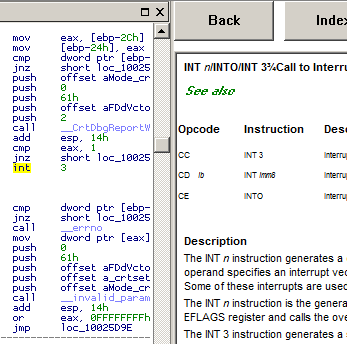
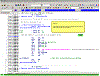
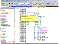
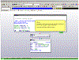

# Hex-Rays Plugin Contest Results 2010

This time we received less submissions but all of them are really good and useful! We are sure that you too will find them useful and increasing your productivity.

This time, all participants will get prizes:

1.  [Joxean Koret with MyNav, a python plugin for IDA](#mynav)
2.  [Ero Carrera from Zynamics with the ida2sql plugin](#ida2sql)
3.  [Fabio Fornaro with the IDA WinHelp Viewer plugin](#idawinhelpviewer)

Well, if we have that few participants the next time, everyone may win again 🙂

Here’s the list of submissions in the alphabetic order:

# ida2sql
**Ero Carrera from [Zynamics](http://www.zynamics.com/) with the ida2sql plugin** 

As the name implies this plugin can be used to export information from IDA databases to SQL databases. This allows for further analysis of the collected data: statstical analysis, building graphs, finding similarities between programs, etc.

The project’s wiki page may inspire you: http://wiki.github.com/zynamics/ida2sql-plugin-ida.

**Download link:** [project page on github](https://github.com/zynamics/ida2sql-plugin-ida)

# idawinhelpviewer

**Fabio Fornaro with the IDA WinHelp Viewer plugin**

 

A quote from the documentation:

The IDAWinHelpViewer plugin started as rework of another very simple IDA plugin, never published, that loaded the original WinHelp file though the usual WinHelp API and thus visualizing the selected opcode in the classic WinHelp client…

**Our comments:** The idea is very simple: make it easy to display WinHelp files in IDA. There is no need to even have the WinHelp executable installed, just copy the plugin into the IDA plugins directory, the plugin can read .hlp files without any external help. It comes with a good x86 instruction reference file. Pressing F2 staying on an instruction gives detailed information about it:

**Download link:** [IDAWinHelpViewer.zip](PlugIn/IDAWinHelpViewer.zip)

# mynav

**Joxean Koret with MyNav, a python plugin for IDA**

 

This is a very powerful python-based plugin. Joxean tried to describe it with one line:

[MyNav is an Open Source plugin for IDA which aims to help reverse engineers doing the most typical tasks.](PlugIn/README-2.txt)

**Our comments:** We love this plugin. The description above is too generic and does not really show the plugin’s power. You may check the [readme.txt](PlugIn/README-2.txt) file for more functionality or, better, just watch the tutorial videos kindly prepared by Joxean:

  

[Analyzing Windows kernel32.dll!CreateFileA function](PlugIn/navigator.swf)

 

[Exporting and importing symbols](PlugIn/exportimport.swf)

[Analyzing Adobe Acrobat Reader’s JavaScript plugin](PlugIn/acrobatjs.swf)

For more information about the plugin and new version (we hope that there will be more improvements in the future), please check its official web site: [http://joxeankoret.com](http://joxeankoret.com/)

**Download link:** [mynav-1.0.1.zip](PlugIn/mynav-1.0.1.zip)

# Final notes

We would like to thank everyone who participated in the contest. Despite of the fact that we had less participants this time, we plan to declare a new one soon.

A note to the downloaders: please be aware that all files come from third parties. While we did our best to verify them, we cannot guarantee that they work as advertised, so use them at your own risk.

For the plugin support questions, please contact the authors.

Date: 22 July 2010

All entries and winners from the other years can be viewed below: