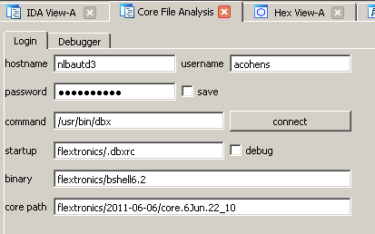
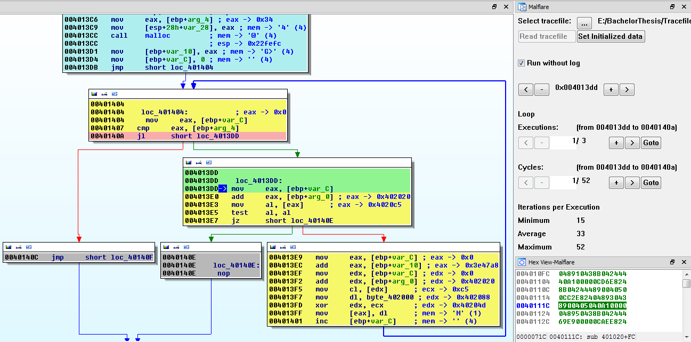

# Hex-Rays Plugin Contest Results 2011

This year we received five submissions, more than the previous time! While all plugins are useful, we can choose only two winners.

Based on the plugin’s functionality, robustness, usefulness, ease of use and documentation, we declare the following winners:

1.  [Jennifer Baldwin from the University of Victoria with the Tracks plugin](#tracks)
2.  [Branko Spasojevic with the optimice plugin](#optimice)

Congratulations!

Below is the list of submissions in the alphabetic order:

# AnalyzeCore

Avi Cohen Stuart with the AnalyzeCore plugin

 A quote from the documentation:

> This is an attempt to make a plugin for IDA that should assist in analyzing unix core dumps.

**Our comments:** We thank Avi for his submission. His plugin demonstrates how to use many IDA API calls, including working with structures and segments, directly interacting with Qt, establishing communication with other computers using sockets, etc. Even if you do not work with core files, you will find lots of useful information in the source code!

**Download link:** [analyzecore.zip](PlugIn/analyzecore.zip)

# optimice
Branko Spasojevic with the optimice python plugin

A quote from the documentation:

> This plugin enables you to remove some common obfuscations and rewrite code to a new segment. Currently supported optimizations are:
> 
> *   Dead code removal
> *   JMP merging
> *   JCC opaque predicate removal
> *   Pattern based deobfuscations

**Our comments:** Optmice is very easy to setup and is useful when it comes to cleaning up a database that is loaded with dead code, jumps into the middle of an instruction and other things. The plugin is still young, nonetheless, we believe it can reach a more mature state where it can handle other obfuscation patterns and offer a more user-friendly interface.

**Download link:** optimice v0.13.zip Presentation

# MalflarePluginContest

Dominic Fischer and Daniel Jordi from Bern University of Applied Sciences with the Malfare plugin

A quote from the documentation:

> The plugin merges dynamic information with the information of the static analysis given by IDA. Those dynamic information are gathered with another plugin for TEMU ([http://bitblaze.cs.berkeley.edu/temu.html](http://bitblaze.cs.berkeley.edu/temu.html)) and containing executed instructions, memory and registers. With both, dynamic and static data, our plugin is able to detect loops, to reconstruct memory and registers at any given time and to annotate systemcalls with its arguments. In addition we created a pseudo debugger, which can navigate (forwards and backwards) through the binary and its data collected from the dynamic analysis.

**Our comments:** Dominic and Daniel’s idea is very nice. We tried the pre-compiled plugin with the sample trace file and we could trace the recorded execution of the program from start to end. Unfortunately we had difficulties compiling the plugin from the sources and later encountered runtime errors. The plugin could have been a winner if the pseudo-debugger was actually a debugger module for IDA and would be more robust.

**Download link:** [MalflarePluginContest.tar.bz2](PlugIn/MalflarePluginContest.tar.bz2)

# Tracks
Jennifer Baldwin from the University of Victoria with the Tracks plugin (part of the AVA project)

A quote from the documentation:

> The plugin is called Tracks, which is part of the AVA (assembly visualization and analysis) project. Tracks provides both static and dynamic sequence diagrams.
> 
> A demo video (entitled The Three Views in Tracks) can be seen here, which explains how to use both of these things. Please note that the navigation view shown in the video encountered serious problems with lines disappearing in IDA and unwanted events, so it has since been removed. Please run Tracks by selecting “AVA Framework” under the plugins. It will automatically open the Tracks program and load the static control flow informa

**Our comments:** The Tracks plugin worked directly out of the box. The presentation video was well prepared and conveyed most of the functionality of the plugin. We found the plugin most useful when we started the debugger and let it trace the program and later we switched to the AVA window to see the program flow using sequence diagrams. A nice way of representing the program execution information, indeed!

**Download link:** [Tracks.zip](PlugIn/Tracks.zip)

# REProgram
Jimmy Koppel with the reprogram plugin

A quote from the documentation:

> REProgram allows you to make almost-arbitrary changes to an executable when run under the debugger. To use it, select the region of code you wish to replace, and run REProgram from the Plugins menu or press Alt+F2. In the prompt that pops up, enter the (possibly empty) code that you wish to run instead of the selected code. To return the region to normal, place your cursor anywhere within the reprogrammed region and run the plugin again.

**Our comments:** The reprogram plugin is a very handy addition to IDA, especially when you want to quickly patch the database, fix some bugs and seamlessly apply the changes when the process is being executed.

**Download link:** [reprogram.zip](PlugIn/reprogram.zip)

# Final notes

We would like to thank everyone who participated in the contest. We received quite interesting plugins this year. We are looking forward to receiving more submissions in the next contest.

A note to the downloaders: please be aware that all files come from third parties. While we did our best to verify them, we cannot guarantee that they work as advertised, so use them at your own risk.

For the plugin support questions, please contact the authors.

Date: 22 July 2011

All entries and winners from the other years can be viewed below: