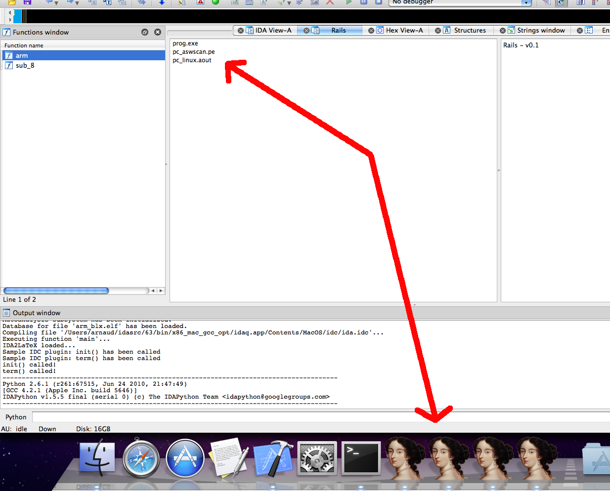
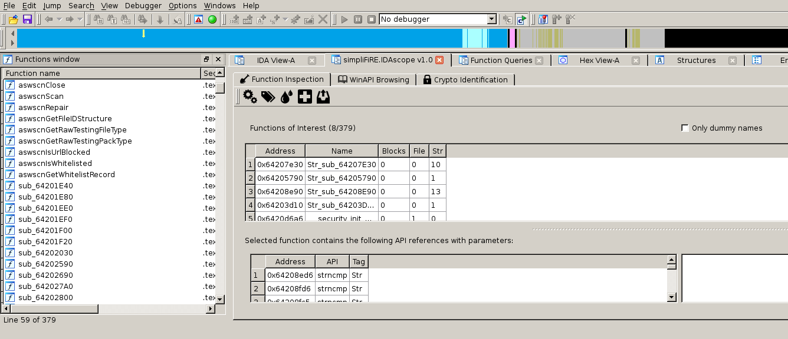
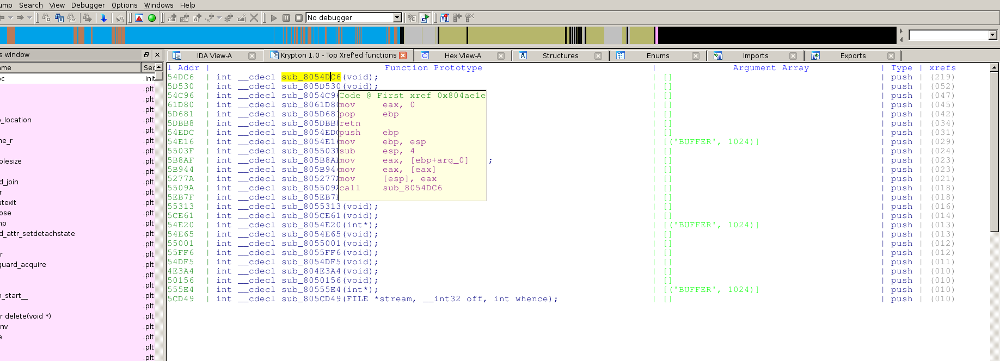
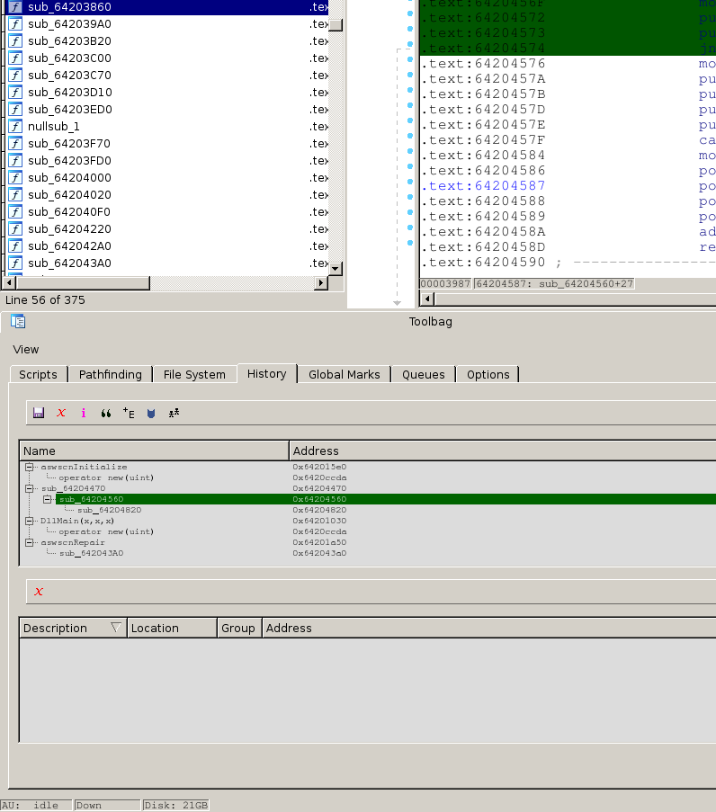
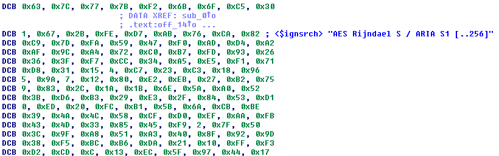

This year the plugin contest gathered five contestants. But as you know, there can only be one, well, two winners!

Based on the plugin’s functionality, robustness, usefulness, ease of use and documentation, we declare the following winners:

1.  [Aaron Portnoy, of Exodus Intelligence, with the IDA Toolbag plugin](#idatoolbag)
2.  [Daniel Plohmann, of the Fraunhofer FKIE, with the IDAscope plugin](#idascope)

Congratulations to both! We are pleased with the improved plugin quality and complexity.

Below is the list of all submissions in no particular order. All contest entries are interesting and useful:

# Rails
**Dean Pucsek’s Rails plugin**

A quote from the documentation:

> Rails is a plugin that simplifies the task of working with multiple instances of IDA Pro. It allows you to view comments from other open instances of IDA, jump to other open instances, and jump directly to the function definition in the instance that owns it.

**Our comments:** Rails is a neatly written little plugin for OS X that lets the user link multiple local instances of IDA. It will most certainly help you reduce the amount of `Cmd+Tab`bing, and save your time from searching for functions! It will be very useful when working with projects consisting of several interoperating modules.

Dean has recorded [a nice video](https://youtu.be/BbB7WLEIr9I), explaining how the plugin works.

**[Download Rails](PlugIn/rails.tar.gz)**

Source on Github

# idascope
**Daniel Plohmann’s IDAscope plugin**

A quote from the documentation:

> IDAscope is an IDA Pro extension, intended to ease reverse engineering with a focus on malware analysis

**Our comments:** The short quote coming from the documentation gives a pretty good higher-level idea what IDAscope is about, but in case you want a slightly more detailed introduction, here are its most important features:

*   Automatically tag unnamed functions with information gathered from the API calls it makes; that provides the reverser with a quick initial insight about what the function does (e.g., deals with files, network, etc…)
*   Spot ‘wrapper’ functions: those that make a function call (e.g., an API call), but hardly do anything else interesting.
*   Provide an in-IDA WinAPI browser. You won’t ever need to leave the IDA window anymore! (well, when working on Windows files, that is)
*   Apply heuristics to spot blocks of code that look like cryptography routines.

IDAscope provides several very helpful tools that IDA is missing out-of-the-box; especially when it comes to applying heuristics to make uncertain decisions. Such heuristics can help greatly by providing starting points when analyzing malware.

**[Download IDAscope](PlugIn/IDAscope_v_1_0.zip)**

[Source on Github](https://bitbucket.org/daniel_plohmann/simplifire.idascope/)

[Author’s blog](https://pnx-tf.blogspot.be/)

# Krypton
**Karthik Selvaraj’s Krypton plugin**

Here’s the short description, from the documentation:

> Krypton is an IDA Plugin that assists one in executing a function from IDB (IDA database) using IDA’s powerful Appcall feature
> 
> krypton takes xrefs from a given function (say a possible decoder) to find all function calls to it and then parses and finds the parameters used (including prototype, no of arguments, and the arguments themselves) from instructions and uses them to execute the function using Appcall, this is most useful in analyzing a malware binary with encryption

**Our comments:** Krypton can be very useful if you’re often dealing with malware that encrypts its strings or other commonly used data. The source code was clean and the documentation very helpful.

**[Download Krypton](PlugIn/Krypton_2012_Hex-Rays_Contest.zip)**

# idatoolbag
**Aaron Portnoy’s IDA Toolbag plugin**

The IDA Toolbag plugin provides many handy features, such as:

*   A ‘History’ view, that displays functions in the disassembly that you have decided are important, and the relationships between them.
*   A code path-searching tool, that lets you find what functions (or blocks) are forming a path between two locations.
*   Manage and run your IDC/Python scripts
*   Something that’s also of considerable importance is that the IDA Toolbag lets you collaborate with other IDA users: one can publish his ‘History’, or import another user’s history & even merge them!
*   See the official documentation for an extensive feature list.

**Our comments:** Not only is the list of features the IDA Toolbag offers very impressive, it also brings collaboration to the rank of a first-class citizen in IDA workflows. It is the clear winner among this year’s submissions.

**[Download IDA Toolbag](PlugIn/aaronportnoy-toolbag-1c42a2f.zip)**

[Source on Github](https://github.com/aaronportnoy/toolbag)

# IDA_Signsrch
**The IDA_Signsrch plugin**

The IDA_Signsrch Win32 plugin is a handy port of Luigi Auriemma’s signature matching tool [signsrch](http://aluigi.altervista.org/mytoolz.htm). It can scan the whole database and comment known byte sequences, e.g. standard encryption constants or compression dictionaries.

**Our comments:** Improved for speed, coming with a rich set of predefined signatures, and featuring a clever and efficient pattern-matching algorithm, IDA_Signsrch is a valuable addition to any reverse engineer.

**[Download IDA_Signsrch](PlugIn/IDA_Signsrch.rar)**

[Discuss](http://www.macromonkey.com/bb/viewtopic.php?f=65&t=886)

[Author’s blog](http://www.sirmabus.macromonkey.com/)

# Final notes

We would like to thank everyone who participated in the contest. As is usually the case, we received quite interesting plugins this year. We are looking forward to receiving more submissions in the next contest.

A note to the downloaders: please be aware that all files come from third parties. While we did our best to verify them, we cannot guarantee that they work as advertised, so use them at your own risk.

For the plugin support questions, please contact the authors.

Date: 21 September 2012