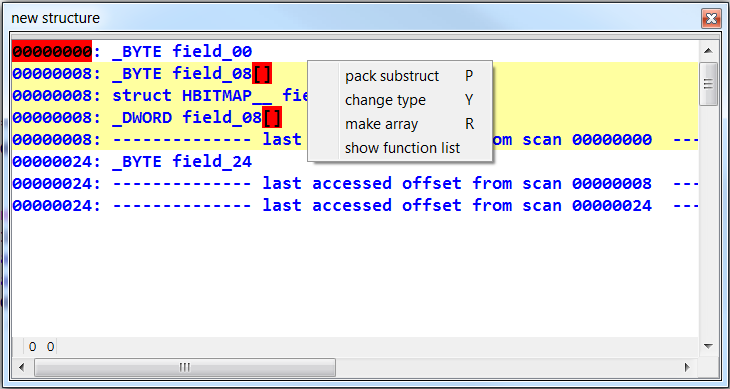

# Hex-Rays Plugin Contest Results 2013

Apparently, 2013 was the year of the decompiler. From the four submissions, three were decompiler plugins. We’re happy to see our users going in new directions!

This year for the first time we’re awarding three prizes. And here’s our conclusion:

*   First prize (1900 USD): [Milan Bohacek, hexrays_tools plugin](#hexrayscodexplorer)
*   Second prize (950 USD): [Andrzej Dereszowski, funcap plugin](#funcap)
*   Third prize (450 USD): [Jason Geffner, CrowdDetox plugin](#hexrays_tools)

Congratulations to the winners!

Below is the full list of submissions:

# HexRaysCodeXplorer

by Aleksandr Matrosov and Eugene Rodionov

This plugin offers several additions for the Hex-Rays decompiler.

> – Type REconstruction automatically builds a structure definition based on accesses to a pointer variable (similar to the built-in “Create new structure” feature) – C-tree graph visualization shows the decompiled function’s C-tree in a graph format – Object Explorer tries to identify and display information about C++ objects’ virtual tables in the executable

**Our comments:**

While the plugin did not win a prize this time, it shows promise and its source code could be a good starting point for other plugin developers. We encourage the authors to submit it to the next contests if they make substantial improvements.

**[Download HexRaysCodeXplorer](PlugIn/HexRaysCodeXplorer_v1.0.zip)**

[Source on Github](https://github.com/REhints/HexRaysCodeXplorer)

[Authors’ web site](http://rehints.com/)

# funcap

by Andrzej Dereszowski

This IDAPython script uses IDA’s debugging API to record function calls in a program together with their arguments (before and after).

This is very useful when dealing with malware which uses helper functions to decrypt their strings, or programs which make many indirect calls.

**Our comments:** The plugin is well-documented and offers several extra features (such as the call graph). Augmenting static disassembly with info from dynamic execution can speed up investigation of an unknown binary, so it will likely be very useful for many analysts!

**[Download funcap](PlugIn/funcap.zip)**

[Source code on Github](https://github.com/deresz/funcap)

# CrowdDetox 

by Jason Geffner

CrowdDetox is another decompiler plugin. It tries to solve the problem which can happen when dealing with obfuscated binaries: removal of junk code (useless code).

**Our comments:**

While the decompiler already does some dead code removal, it opts for pessimistic approach and doesn’t remove code unless it can prove its results are not used. Jason’s plugin is useful in situations where you can make more assumptions and be more aggressive in code removal.

We thank Jason for contacting us before the contest and implementing our feedback (e.g. making the plugin optional and not always-on). The code is very well commented and has a supporting whitepaper which explains the approach used.

**[Download CrowdDetox](PlugIn/CrowdDetox.zip)**

[Source code on Github](https://github.com/CrowdStrike/CrowdDetox)

[CrowdStrike community tools](https://www.crowdstrike.com/community-tools/index.html)

# hexrays_tools 

by Milan Bohacek, Charles University in Prague

This plugin adds dozens of new functions to the decompiler and IDA:

> – interactive structure reconstruction using pointer variable accesses across multiple functions – finding a structure which matches a given pattern of accesses to a pointer variable – function prototype helpers: remove return type, remove argument, convert to __usercall – quick propagation of type from one side of assignment to another, or from a function call to the function pointer – handle C++ classes and virtual function tables, with support for navigation to virtual functions from the decompiler – structure editor improvements – show a tree of related structures in a graph – and several more minor features

**Our comments:** Milan’s plugin is invaluable when dealing with complex, object-oriented code. While structure reconstruction and C++ support are the main highlights, even the smaller features help with many repetitive tasks which are common when dealing with big code bases. It’s a clear winner of this year’s submissions.

**[Download hexrays_tools](PlugIn/hexrays_tools.zip)**

[Readme file](PlugIn/milan_readme.txt)

[Demo videos](PlugIn/milan_videos.7z)

* * *

**Final notes**

We would like to thank all participants for their useful and interesting submissions. We are looking forward to the next contest!

**The usual disclaimer**

Please be aware that all files come from third parties. While we did our best to verify them, we cannot guarantee that they work as advertised, so use them at your own risk.

For the plugin support questions, please contact the authors.

Date: 20 September 2013

All entries and winners from the other years can be viewed below: