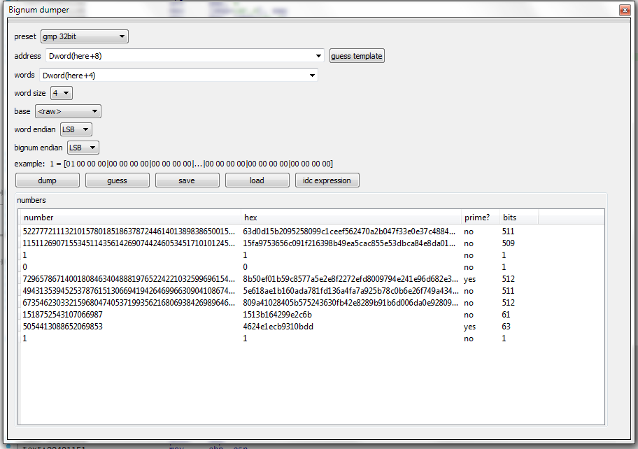
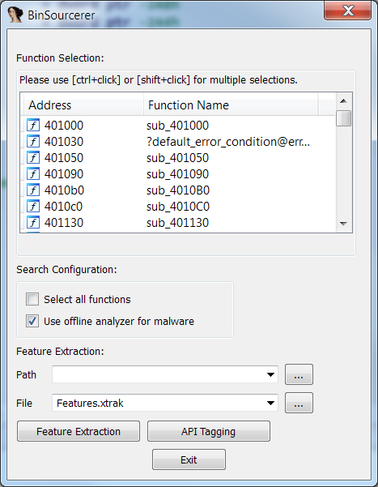
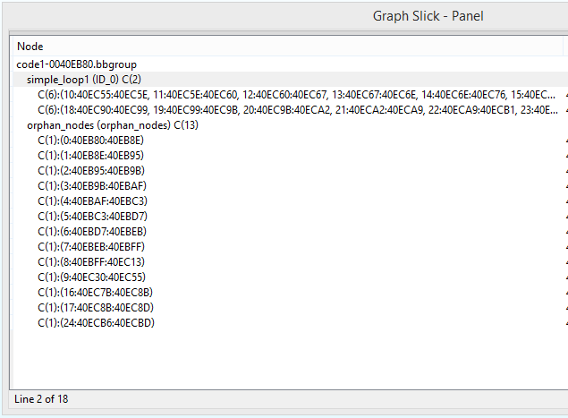
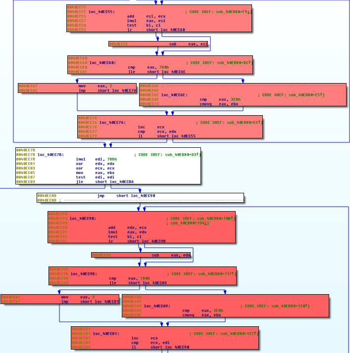
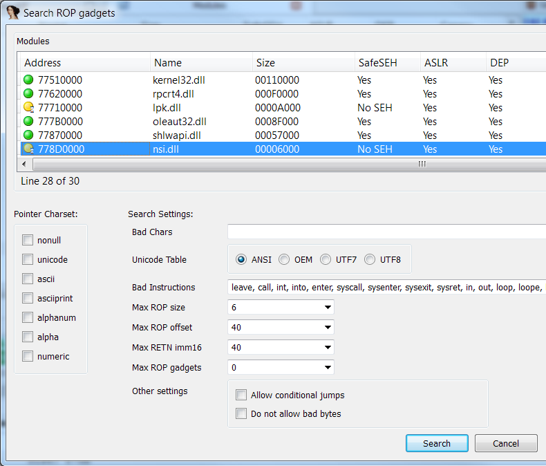
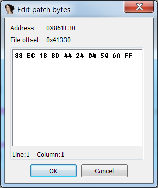

# Hex-Rays Plugin Contest Results 2014

We’ve had four contestants this year. All of them were interesting, but we had to choose three. Here’s the final ranking:

*   First prize (1900 USD): [Peter Kacherginsky, IDA sploiter](#peter)
*   Second prize (950 USD): [Microsoft, GraphSlick](#graphslick)
*   Third prize (450 USD): [Concordia University, BinSourcerer](#binsourcerer)

Congratulations to the winners!

Below is the full list of submissions:

# Bignum dumper
by Milan Bohacek, Charles University in Prague

Last year’s winner is back with a new plugin. His description:

> #### Bignum dumper
> 
> Is an IDA plugin with dual purpose.
> 
> *   Assisting with dumping of big integers from IDA database.
> *   Find relations between the acquired integers.

**Our comments:** This plugin is very useful when working with crypto code which uses big numbers, such as RSA or ECC. It knows many common formats of storing such numbers and even has some heuristics to detect them automatically.

**[Download Bignum dumper](PlugIn/bignum.zip)**

[Readme/documentation](PlugIn/readme.html.mht)

# BinSourcerer from Concordia University

Ashkan Rahimian from Concordia University sent an interesting submission:

> BinSourcerer is an assembly to source code matching framework written in Python. The main purpose of BinSourcerer is to recreate the functionalities that RE-Google provided, until the Google Code Search API was discontinued. This plugin can be used for code search (GitHub, Ohloh, etc.) and function tagging. It generates a disassembly feature file that can be used in various binary analyzes. Moreover, the framework functionalities are easily expandable.

**Our comments:** In addition to code search, the plugin can tag the functions in the binary based on the APIs being used. This can save time when dealing with many different samples. The author also provided several videos demonstrating the features of their plugin.

**[Download BinSourcerer](PlugIn/BinSourcerer.zip)**

**[BinSourcerer repository on github](https://github.com/BinSigma/BinSourcerer)**

[Videos](PlugIn/videos.zip)

# GraphSlick from Microsoft

Elias Bachaalany, Ali Rahbar and Ali Pezeshk from Microsoft submitted a plugin which solves a very interesting problem: automated detection of inlined functions. It highlights similar groups of nodes and allows you to group them, simplifying complex functions. The authors provide an accompanying presentation which explains the algorithms behind the plugin and shows sample use cases.

**[Download GraphSlick](PlugIn/graphslick.zip)**

[readme](PlugIn/readme-4.txt)

# IDA Sploiter, IDA Patcher, and IDA Pomidor 

by Peter Kacherginsky

Peter has submitted not one or two, but three plugins! He provided the following descriptions:

> #### IDA Sploiter
> 
> IDA Sploiter is a plugin for Hex-Rays IDA Pro disassembler designed to enhance IDA’s capabilities as an exploit development and vulnerability research tool. Some of the plugin’s features include a powerful ROP gadgets search engine, semantic gadget analysis and filtering, interactive ROP chain builder, stack pivot analysis, writable function pointer search, cyclic memory pattern generation and offset analysis, detection of bad characters and memory holes, and many others.
> 
> This plugin brings vulnerability research functionality from various debuggers and scripts under a single, powerful and convenient platform.
> 
> #### IDA Patcher
> 
> IDA Patcher is a plugin for Hex-Ray’s IDA Pro disassembler designed to enhance IDA’s ability to patch binary files and memory. The plugin is useful for tasks related to malware analysis, exploit development as well as bug patching. IDA Patcher blends into the standard IDA user interface through the addition of a subview and several menu items.
> 
> This plugin exposes many of IDA’s internal patch management features using various UI elements.
> 
> #### IDA Pomidor
> 
> IDA Pomidor is a fun and simple plugin for the Hex-Ray’s IDA Pro disassembler that will help you retain concentration and productivity during long reversing sessions. The plugin uses a Pomodoro Technique©, a popular time management technique.
> 
> This plugin helped me survive through long reversing sessions and I hope you will find it useful as well.

**Our comments:**

IDA Sploiter is the clear winner of this year’s contest. Very nicely designed UI, clear and well-commented code, and good usage of the features provided by IDA API (choosers, forms, custom menu items and so on). Despite the complexity of the task, the plugin is pretty fast and robust. It will be a great tool in the arsenal of vulnerablity researchers.

The other two plugins are simple, but well-made. They are a good example of how to use IDA APIs.

**[Download IDA Sploiter](PlugIn/idasploiter-1.0.zip)**

**[Download IDA Patcher](PlugIn/idapatcher-1.2.zip)**

**[Download IDA Pomidor](PlugIn/idapomidor-1.0.zip)**

[Author’s website (includes documentation for the projects)](http://thesprawl.org/projects/)

# Final notes

As always, many thanks to all the participants for their useful and interesting submissions. We are looking forward to the next contest!

**The usual disclaimer**

Please be aware that all files come from third parties. While we did our best to verify them, we cannot guarantee that they work as advertised, so use them at your own risk.

For the plugin support questions, please contact the authors.

Date: 19 September 2014

All entries and winners from the other years can be viewed below: