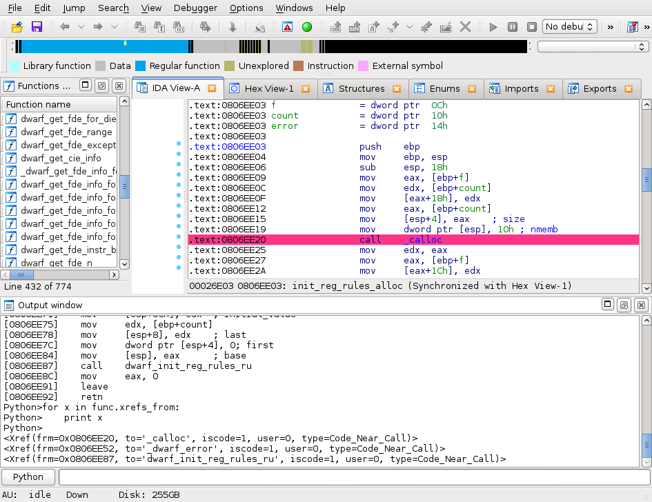

# Hex-Rays Plugin Contest Results 2015

We’ve had 7 contestants this year! All plugins were interesting, but we had to choose three. Here’s the final ranking:

*   First prize (2000 USD): [Yaniv Balmas, Dynamic IDA Enrichment (DIE) framework](#die)
*   Second prize (1000 USD): [Steven H. H. Ding, McGill University, Kam1n0](#kam1n0)
*   Third prize (500 USD): [Alexander Matrosov, Eugene Rodionov, Rodrigo Branco & Gabriel Barbosa, HexRaysCodeXplorer](#hexrayscodexplorer)

Congratulations to the winners!

Below is the full list of submissions:

# Sark
by Tamir Bahar

Sark is:

> #### IDAPython Made Easy
> 
> Sark is an object-oriented scripting layer written on top of IDAPython. Sark is easy to use and provides tools for writing advanced scripts and plugins

**Our comments:**

The idea behind Sark is very good: while Hex-Rays is in charge of providing a low-level API that resembles as much as possible the original SDK both in what it provides and how it behaves, users are encouraged to write their own “pythonic” helpers on top of that.

But Sark is, in fact, a bit more than just that: it also provides some graphing of the function call graph, and comes with a set of satellite plugins that can make a reverser’s life easier.

Sark is a bit of a strange beast in a plugin contest, because it doesn’t really provide that much out-of-the-box additional functionality. Rather, we view it as a comfortable pythonic foundation on top of which scripts/plugins writers can rely (and it has very complete documentation.)

**[Get Sark from github](https://github.com/tmr232/Sark)**

[Sark docs](https://sark.readthedocs.org/en/latest/)

# IDARef 

by Mikhail Sosonkin

IDARef is:

> IDA Pro Full Instruction Reference Plugin

**Our comments:**

IDARef displays documentation about the instruction on the line of the cursor. That can be a very helpful tool, but the plugin could be improved with regards to usability, in order to become more responsive.

IDARef comes with instructions references for x86[_64], ARM and MIPS.

**[Get IDARef from github](https://github.com/nologic/idaref)**

**[Download IDARef](https://hex-rays.com/wp-content/uploads/2019/12/idaref.zip)**

# die 
by Yaniv Balmas

This year’s winner is:

> #### Dynamic IDA Enrichment (aka. DIE)
> 
> DIE is an IDA python plugin designed to enrich IDA`s static analysis with dynamic data. This is done using the IDA Debugger API, by placing breakpoints in key locations and saving the current system context once those breakpoints are hit.
> 
> The saved context consist of function arguments and register states, and it is saved upon each function CALL and function RETURN.
> 
> DIE takes advantage of IDA`s powerful analysis engine so that when context is taken DIE is fully aware of known function prototypes, data types, structures, unions, arrays and basically every piece of information IDA provides during static analysis.

**Our comments:**

Although the idea is not new ([funcap](https://github.com/deresz/funcap)‘s author Andrzej Dereszowski had the same idea), it seems Yaniv went one step further in both how clever the plugin is (out-of-the-box) at spotting interesting types, and at providing extension points for you to write your own types handlers.

The code seems well written enough to make that task easy (that is: as easy as can be), and the plugin results are usually very interesting (check out the videos linked to from the github page!) The UI is pretty well designed, too!

A significant annoyance with DIE at the moment is that it is only guaranteed to work on Windows (although it’s written in Python). Hopefully Yaniv will be able to address that so that Linux and OSX users will be able to use it as well!

**[Get DIE from github](https://github.com/ynvb/DIE)**

# IFL – Interactive Functions List 

by Hasherezade

> #### IFL, the Interactive Functions List
> 
> It’s goal is to provide user-friendly way to navigate between the functions and their references.

**Our comments:**

IFL brings an alternative view to the existing IDA functionalities that can be found in the standard “Functions window” and “Function calls” window (that can be found through the menus: View > Open subviews > Function calls).

The plugin is a little too light to compare against this year’s winners, but it’s always insightful to see what people are doing with IDA’s API in order to improve it.

**[Download ifl.py](https://hex-rays.com/contests_details/contest2015/ifl/ifl.py)**

**[Get IFL from github](https://github.com/hasherezade/ida_ifl)**

# Kam1n0 

by Steven H. H. Ding, McGill University

> #### [IDA Plugin for] Kam1n0
> 
> Assembly code analysis is a time-consuming process. An effective and efficient assembly code clone search engine can greatly reduce the effort of this process, since it can identify the cloned parts that have been previously analyzed.
> 
> Kam1n0 is a scalable system that supports assembly code clone search. It allows a user to first index a (large) collection of binaries, and then search for the code clones of a given target function or binary file

**Our comments:**

This year’s runner-up is a massive undertaking: it brings a database for storing disassembly results that, later, will be used to match against other binaries in order to find correspondences between the two.

The plugin that was submitted is, in fact, a small part of the Kam1n0 project: it’s only the hook into IDA, that is used to extract disassembly. Therefore when looked at through the “plugin contest jury” goggles, the plugin doesn’t come out as very interesting.

However, the promises it makes (and seems to deliver: our tests gave some nice results) are just too interesting to dismiss the plugin on those terms.

**[Get the IDA plugin for the Kam1n0 engine from github](https://github.com/McGill-DMaS/Kam1n0-Plugin-IDA-Pro)**

# HRDEV 

by Arthur Gerkis

HRDEV is:

> This is an IDA Pro Python plugin to make Hex-Rays Decompiler output bit more attractive. HRDEV plugin retrieves standard decompiler output, parses it with Python Clang bindings, does some magic, and puts back.

**Our comments:**

The plugin brings an alternative view of the Hex-Rays decompiler output, and that can be a good thing. It also uses clang (through Python bindings) to perform some analysis which, in our opinion, could be improved.

Still, it’s interesting to see in what way the decompiler view was not sufficient so that we hope we will be able to improve it in the near future!

**[Get HRDEV from github](https://github.com/ax330d/hrdev)**

# HexRaysCodeXplorer

by Alexander Matrosov, Eugene Rodionov, Rodrigo Branco & Gabriel Barbosa

> #### HexRaysCodeXplorer
> 
> The Hex-Rays Decompiler plugin for better code navigation in RE process. CodeXplorer automates code REconstruction of C++ applications or modern malware like Stuxnet, Flame, Equation, Animal Farm …
> 
> The CodeXplorer plugin is one of the first publicly available Hex-Rays Decompiler plugins. We keep updated this project since summer of 2013 and continue contributing new features frequently. Also most interesting features of CodeXplorer have been presented on numerous security conferences like: REcon, ZeroNights, H2HC, NSEC and BHUS

**Our comments:**

Alexander Matrosov et al. are at it again (they first submitted the plugin for the 2013 contest), with a plugin that provides interesting tools when it comes to re-constructing structures (including virtual tables) of C++ programs.

HexRaysCodeXplorer also comes with other tools which, although in our opinion will likely be of lesser use to most reverse engineers, have the benefit of being there (e.g., viewing/browsing of the decompilation C-like tree.)

**[Get HexRaysCodeXplorer from github](https://github.com/REhints/HexRaysCodeXplorer)**

**[Download HexRaysCodeXplorer](https://hex-rays.com/wp-content/uploads/2019/12/CodeXplorer-Plugin_Contest_2015.zip)**

* * *

**Final notes**

As always, many thanks to all the participants for their useful and interesting submissions. We are looking forward to the next contest!

**The usual disclaimer**

Please be aware that all files come from third parties. While we did our best to verify them, we cannot guarantee that they work as advertised, so use them at your own risk.

For the plugin support questions, please contact the authors.

Date: 22 September 2015

All entries and winners from the other years can be viewed below: