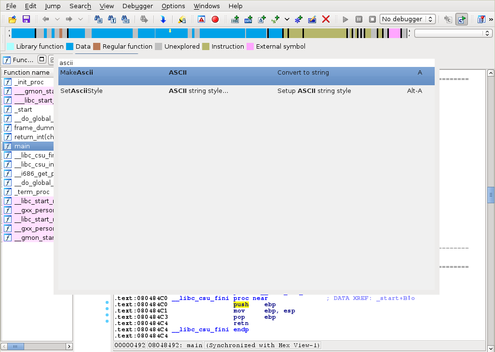
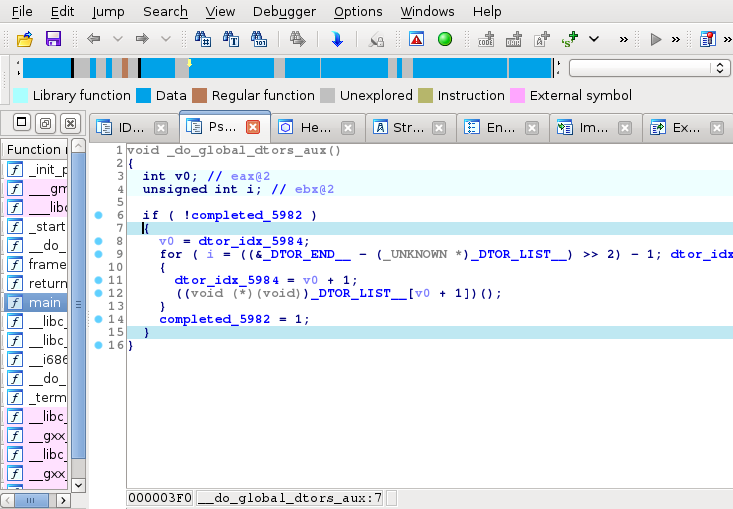
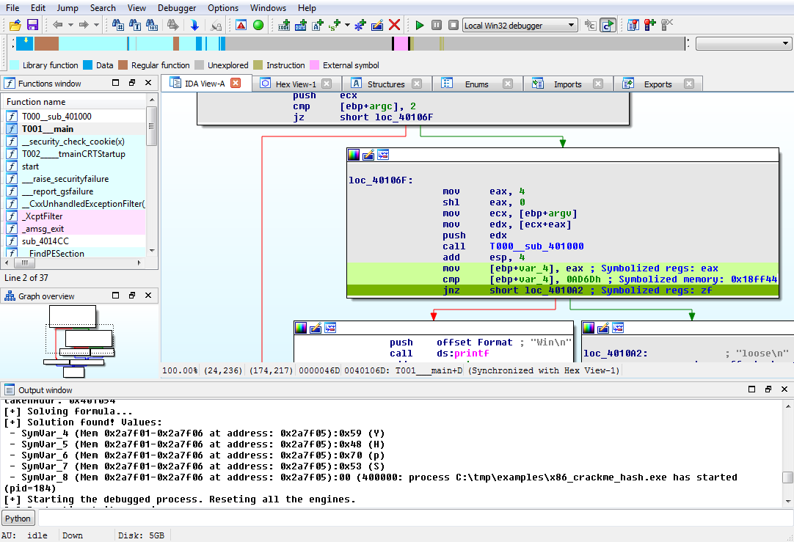
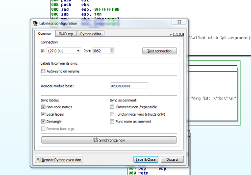
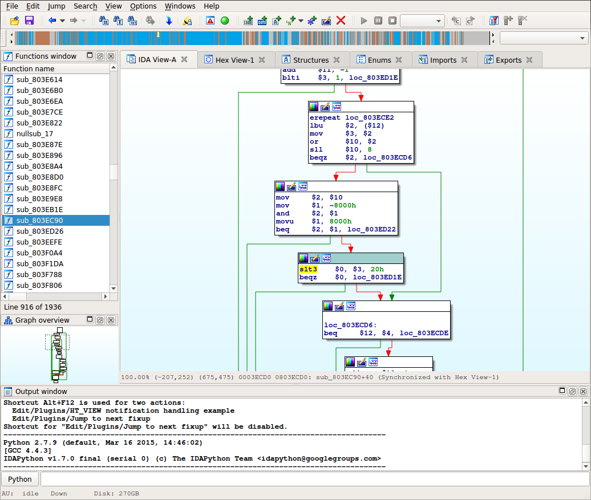
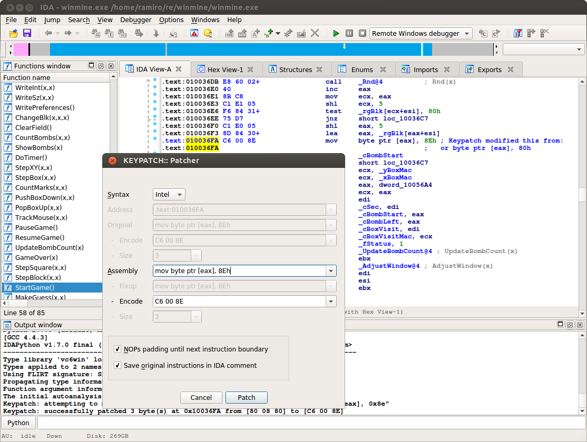
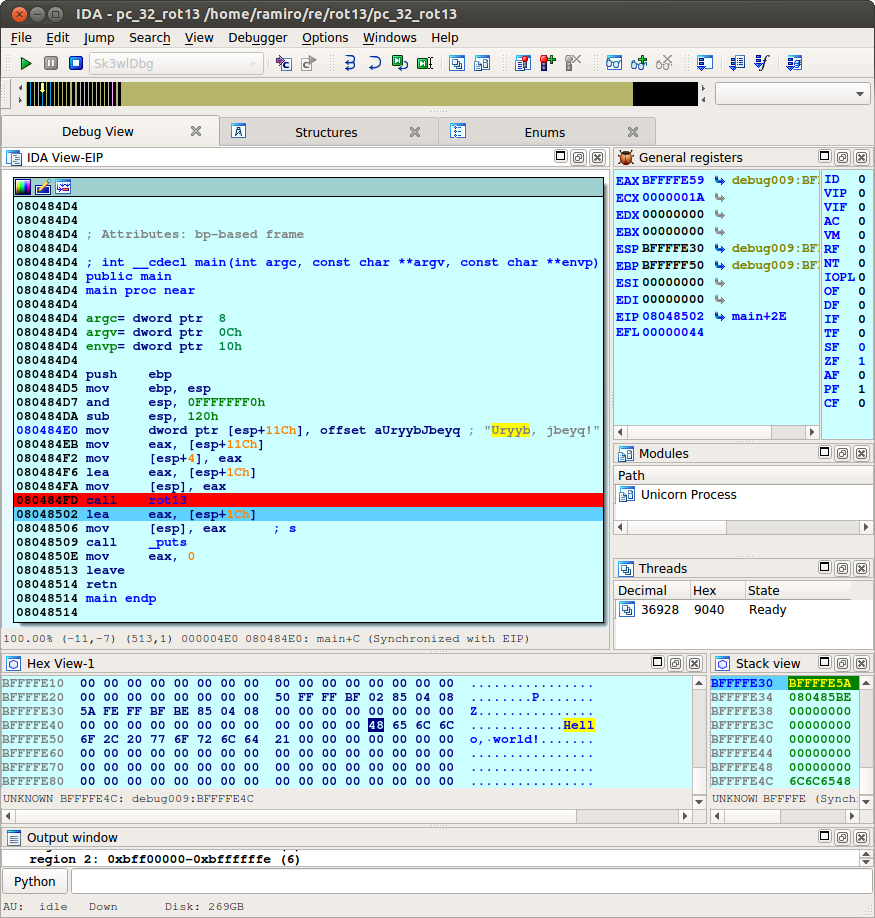
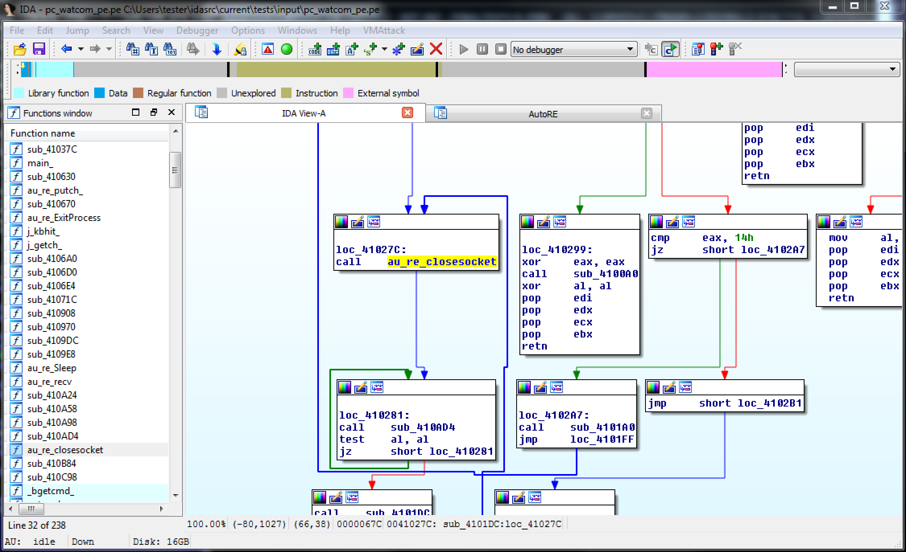
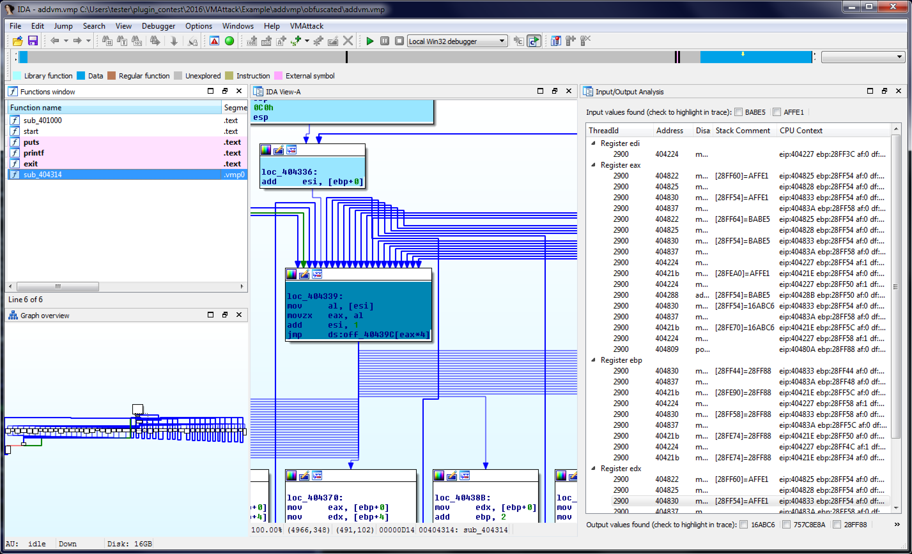

# Hex-Rays Plugin Contest Results 2016

This year, we have examined the plugins of 8 contestants, for a grand total of 10 plugins of overall very high quality, which bring many interesting additional features and, dare we say, _dimensions_ to IDA.

Among those, we had to choose three.

…well, in fact we were having a hard time figuring out exactly which one should win the third place, so we decided to award a third prize to two of them.

Here’s the final ranking:

*   First prize (2000 USD): [Alberto Garcia Illera & Francisco Oca (Salesforce), Ponce](#ponce)
*   Second prize (1000 USD): [Anatoli Kalysch and Tobias Krauß from Friedrich-Alexander University Erlangen-Nuremberg, VMAttack](#vm_attack)
*   Third prize (500 USD): [Nguyen Anh Quynh & Thanh Nguyen, Keypatch](#keypatch), as well as [Aliaksandr Trafimchuk, Labeless](#labeless)

Congratulations to the winners!

Below is the full list of submissions:

# Command Palette

by Milan Bohacek

Command Palette is:

> A blazing fast way of running commands in IDA. It eliminates all unnecessary keypresses / mouse clicks needed to run any command available in IDA.
> 
> It is inspired by command palette from Sublime Text.

**Our comments:**

Command palette is a well-designed utility that, depending on your workflow, might make your life much simpler.

It is written in Python, and is trivial to install & use.

**[Download command_palette.py](PlugIn/command_palette.py)**

# Hexlight 

by Milan Bohacek

Hexlight is:

> A plugin that highlights matching curly brace in the pseudocode view and lets you jump from one brace to the other.

**Our comments:**

Another clever, easy-to-use, great usability improvement by Milan!

**[Download hexrays_hlight.py](PlugIn/hexrays_hlight.py)**

# Ponce

by Alberto Garcia Illera, Francisco Oca (Salesforce)

Ponce is:

> …an IDA Pro plugin that provides users the ability to perform taint analysis and symbolic execution over binaries in an easy and intuitive fashion. With Ponce you are one click away from getting all the power from cutting edge symbolic execution. Entirely written in C/C++

**Our comments:**

Ponce currently suffers from the following significant limitations in our point of view:

*   only works on Windows
*   building it is not exactly a walk in the park

Yet, we have decided to make it this year’s winner, because it bridges the impressive [Triton engine](https://github.com/JonathanSalwan/Triton) with IDA, bringing concolic testing at your fingertips, in a rather well thought out, natural manner.

Although most of the heavy lifting is in fact performed by Triton (and Z3), the integration within IDA is (mostly) cleverly done. There are a few issues that we’re sure will be ironed out over time, but it is already very much usable.

**[Download ponce.zip (Windows-only at the moment)](PlugIn/ponce.zip)**

**[Get Ponce from github](https://github.com/illera88/Ponce)**

Blog entry: **Introducing Ponce**

# Labeless 

by Aliaksandr Trafimchuk

Labeless provides:

> Labeless is a plugin system for dynamic, seamless and realtime synchronization between IDA Database and debug backend. It consists of two parts: IDA plugin and debug backend’s plugin.
> 
> Labeless significantly reduces time that researcher spends on transferring already reversed\documented code information from IDA (static) to debugger (dynamic). It saves time, preventing from doing the same job twice. Also, you can document and add data to the IDB on the fly and your changes will be automatically propagated to debug backend, even if you will restart the virtual machine or instance of debug backend will crash. So, you will never lose your research.
> 
> This solution is highly upgradable. You can implement any helper scripts in Python on debug backend’s side and then just call them from IDA with one line of code, parsing the results and automatically propagating changes to IDB.

**Our comments:**

Labeless is fairly easy to use (with good documentation), and helps bridge the gap between IDA and other popular reversing/debugging tools such as Olly Dbg. It seems pretty stable, too, since it works with (at least) 6.8, 6.9 and 6.95 versions of IDA.

On the ‘cons’ side, there were some issued with the build for idaq64.

Still, overall a pretty useful addition to IDA.

**[Download labeless_release_full_1.1.0.8.7z](PlugIn/labeless_release_full_1.1.0.8.7z)**

**[Get labeless from github](https://github.com/a1ext/labeless)**

# CGEN 
by Yifan Lu

CGEN for IDA Pro is:

> …an extension of CGEN (which is an attempt at modeling CPUs in Scheme and then automatically generating simulators, assemblers, etc) to generate IDA Pro modules.

**Our comments:**

This project was written with the specific goal of implementing a processor module for the Toshiba MeP. Although the goal was achieved, the project has not been extended to support the other CPU descriptions available from CGEN yet.

Unfortunately, development on CGEN seems to have ceased upstream, but this remains a very interesting idea. Perhaps a similar idea could be used to generate processor modules from LLVM, which is an active project.

**[Download cgen.zip](PlugIn/cgen.zip)**

**[Get CGEN from github](https://github.com/yifanlu/cgen)**

# Keypatch 

by Nguyen Anh Quynh & Thanh Nguyen

Keypatch is:

> …a plugin of IDA Pro for Keystone Assembler Engine. See this introduction for the motivation behind Keypatch, and this slides for how it is implemented.
> 
> Keypatch offers 3 tools inside.
> 
> *   Patcher & Fill Range: these allow you to type in assembly to directly patch your binary.
> *   Assembler: this interactive tool let you enter assembly & get back instruction encoding.

**Our comments:**

The Keypatch plugin provides a good alternative to IDA’s “Patch program>Assemble” feature.

Since the plugin is based on the Keystone Assembler Engine, which is itself based on LLVM, it provides support for many architectures, such as x86, ARM, MIPS, SPARC, PPC, and Hexagon.

The Keypatch Patcher updates on-the-fly the instruction encoding as you type, which makes it useful not only for patching but also for quickly testing assembly code syntax (3 are currently supported (AT&T, Intel, and NASM)).

The source code is well-written and easy to understand, the plugin is simple to install and use, and works out-of-the-box. It also features very high quality documentation and tutorials (available on their website.)

**[Download 2.0.1.zip](PlugIn/2.0.1.zip)**

**[Get Keypatch from github](https://github.com/keystone-engine/keypatch)**

# sk3wldbg

 by Chris Eagle

sk3wldbg is:

> …the Sk3wlDbg plugin for IDA Pro. It’s purpose is to provide a front end for using the Unicorn Engine to emulate machine code that you are viewing with IDA.
> 
> The plugin installs as an IDA debugger which you may select whenever you open an IDA database containing code supported by Unicorn. Currently supported architectures include:
> 
> *   x86
> *   x86-64
> *   ARM
> *   ARM64
> *   MIPS
> *   MIPS64
> *   SPARC
> *   SPARC64
> *   M68K

**Our comments:**

Sk3wlDbg is an IDA debugger backend that uses the Unicorn Engine, based on QEMU, to emulate machine code. The idea is similar to that of x86emu, but this plugin leverages the work from QEMU to provide support for many architectures, such as x86, ARM, MIPS, and SPARC.

Sk3wlDbg simplifies the process of stepping through obfuscated code or testing the outcome of small snippets of code; in that it is no longer necessary to configure or open an external QEMU process.

Although the idea is great, we found the plugin still has a rather long way to go before reaching production quality (as the author himself puts it: THIS CODE IS VERY RAW AND PROBABLY VERY BUGGY!)

Let’s hope Chris finds the time to iron out the remaining issues — some of which are severe, such as occasionally crashing IDA (which is why we couldn’t let it make it to the top 3.)

**[Download sk3wldbg.zip](PlugIn/sk3wldbg.zip)**

**[Get sk3wldbg from github](https://github.com/cseagle/sk3wldbg)**

# AutoRE 

by Aliaksandr Trafimchuk

AutoRE is:

> IDA PRO auto-renaming plugin with tagging support.

**Our comments:**

AutoRE will automatically rename functions that have only one API call, making it easier to identify functions that are likely just wrappers around an API function.

It is a good idea and well executed, but the plugin is very lightweight compared to the other plugins this year, and we have also had [similar plugins submitted in the past](https://hex-rays.com/contests_details/contest2012/#idascope).

**[Download auto_re.zip](PlugIn/auto_re.zip)**

**[Get AutoRE from github](https://github.com/a1ext/auto_re)**

# vm_attack 

by Anatoli Kalysch

VMAttack is:

> an IDA PRO Plugin which enables the reverse engineer to use additional analysis features designed to counter virtualization-based obfuscation.
> 
> For now the focus is on stack based virtual machines, but will be broadened to support more architectures in the future.
> 
> The plugin supports static and dynamic analysis capabilities which use IDA API features in conjunction with the plugins own analysis capabilities to provide automatic, semi-automatic and manual analysis functionality.
> 
> The main goal of this plugin is to assist the reverse engineer in undoing the virtualization-based obfuscation and to automate the reversing process where possible.

**Our comments:**

This plugin is quite impressive in terms of the amount of functionality it brings to the table.

It is robust, configurable, and provides a very good balance between static/dynamic analysis techniques.

Like IDA itself, it will likely be most effective in the hands of a talented reverse-engineer, and aside from minor clumsiness in the UI it works quite well.

**[Download vm_attack.zip](PlugIn/vm_attack.zip)**

**[Get VMAttack from github](https://github.com/anatolikalysch/VMAttack)**

# BinAuthor 
by Saed Alrabaee & Perry Jones, Concordia University

BinAuthor is:

> …an IDA pro plugin developed through research at Concordia University in the area of binary authorship identification.
> 
> The main purpose of this tool is to apply cutting edge research in order to solve the difficult task of matching an author to a provided unknown binary.
> 
> Our tool achieves this by applying novel techniques such as statistical analysis and clustering algorithms in conjunction with constructed features to match an author to an unknown binary.

**Our comments:**

BinAuthor comes with exhaustive documentation, and looks very promising in what it claims to do.

Unfortunately, the authors were developing & using it with IDA 6.8, and didn’t have a chance to port it to IDA 6.9 (and 6.95), which is problematic since IDA 6.9 brought the following changes:

*   IDA now uses Qt 5 (6.8 was using Qt 4.8), and more importantly:
*   IDA now ships with PyQt5, while it was shipping with PySide before

Since this plugin makes use of PySide (the installer actually install PySide system-wide), it cannot possibly work with IDA 6.9 (and newer). Under those circumstances, we cannot realistically consider it a challenger, since that would mean asking our users to downgrade to a previous version of IDA, which is not quite feasible.

We sincerely hope that the authors, Saed and Perry, will have the opportunity to port it to PyQt5, so that many more people can benefit from (and bring contributions to!) their work.

**[Download BinAuthor-Final.zip](PlugIn/BinAuthor-Final.zip)**

**[Get BinAuthor from github](https://github.com/g4hsean/BinAuthor)**

# Final notes

As always, many thanks to all the participants for their useful and interesting submissions. We are looking forward to the next contest!

**The usual disclaimer**

Please be aware that all files come from third parties. While we did our best to verify them, we cannot guarantee that they work as advertised, so use them at your own risk.

For the plugin support questions, please contact the authors.

Date: 23 September 2016

All entries and winners from the other years can be viewed below: