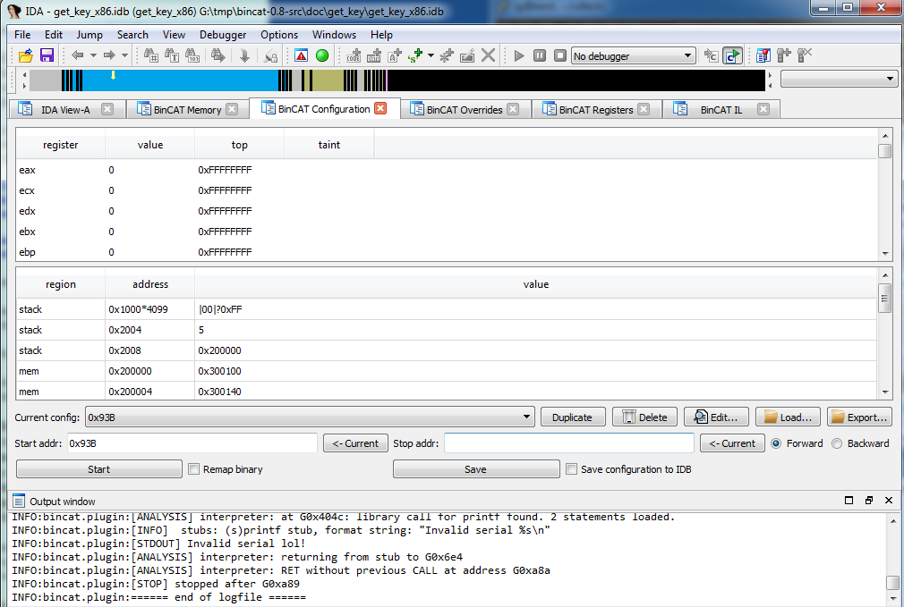
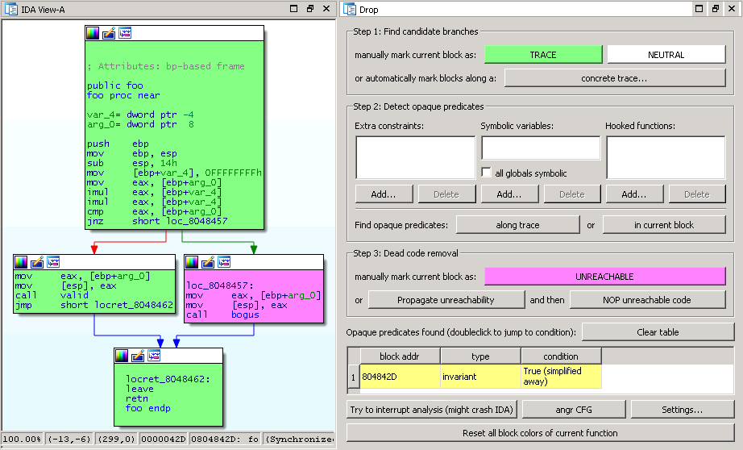
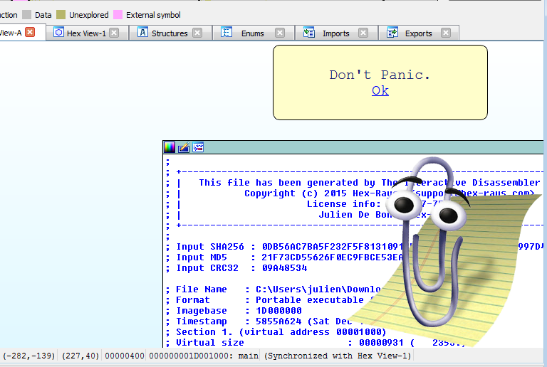
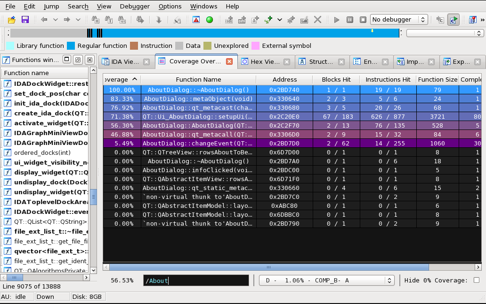
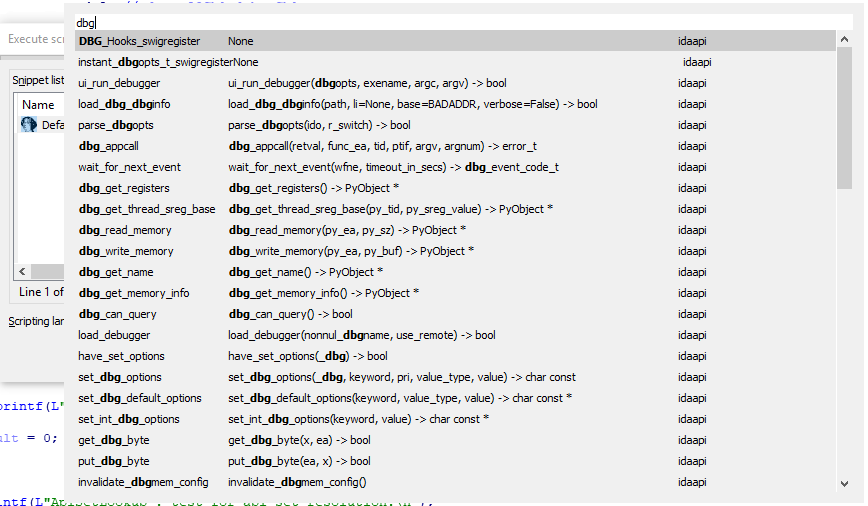
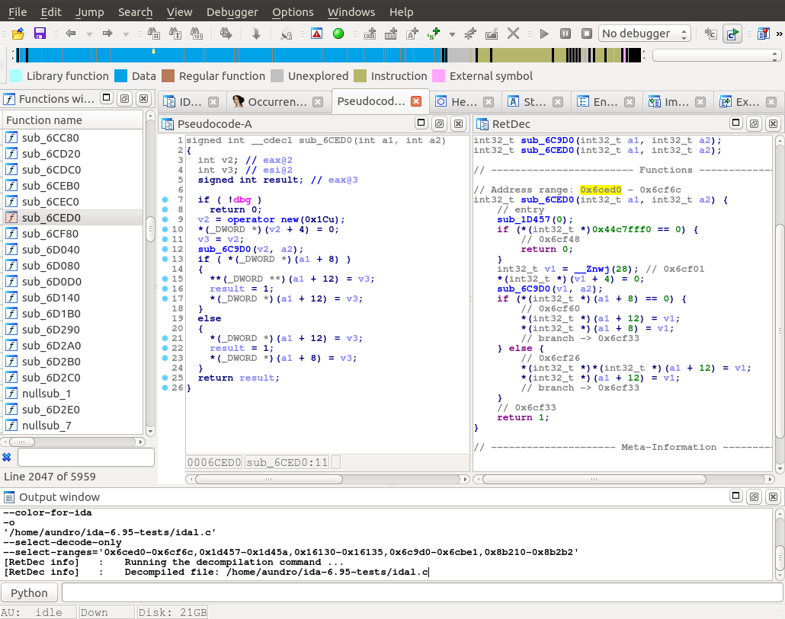
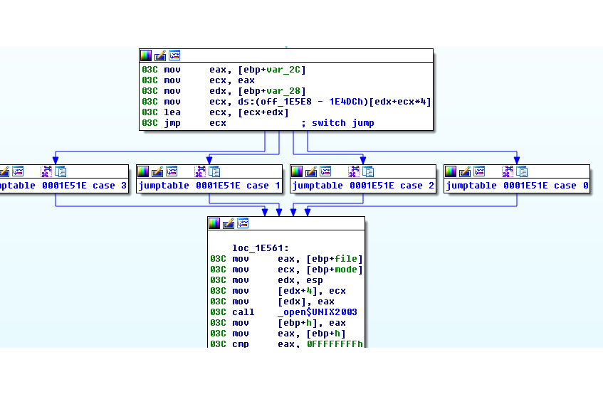

# Hex-Rays Plugin Contest Results 2017

This year, we have examined the plugins of 7 contestants, for a grand total of 9 plugins, of wildly varying scopes & focus.

We picked three winners from those plugins; here’s the final ranking:

*   First prize (2000 USD): [BinCAT](#bincat), by Sarah Zennou, Philippe Biondi, Raphaël Rigo, Xavier Mehrenberger — Airbus
*   Second prize (1000 USD): [lighthouse](#lighthouse), by Markus Gaasedelen
*   Third prize (500 USD): [SimplifyGraph](#simplifygraph), by Jay Smith, FLARE Team, FireEye

Congratulations to the winners!

Below is the full list of submissions:

# BinCAT 

by Sarah Zennou, Philippe Biondi, Raphaël Rigo, Xavier Mehrenberger — Airbus

BinCAT is:

> … a static Binary Code Analysis Toolkit, designed to help reverse engineers, directly from IDA.
> 
> It features:
> 
> *   value analysis (registers and memory)
> *   taint analysis
> *   type reconstruction and propagation
> *   backward and forward analysis

**Our comments:**

This is a complex and useful plugin. It employs abstract interpretation to track register and memory values. It can also perform taint analysis of them. The interpreter is written in OCaml and is compiled into binary form. The plugin itself, which works as interface between the OCaml part and IDA, is written in Python.

The interpreter parses the input file and has the logic to understand the semantics of ARM and x86 instructions. It converts the instructions into an intermediate language for analysis. There is a lot of code (overall the plugin has around 25 KLOCs), which is impressive by itself.

It is easy to get started using the plugin: it comes with a short and clear tutorial. We tried BinCAT with the provided toy example and a couple of other test files. It can handle most cases very well but occasionally may refuse to run.

The value analysis can track individual values well; loops can be unrolled in some situations. The taint analysis can track tainted values down very well, it tracks each bit of the value individually.

The user interface may be confusing in some cases, especially at the beginning.

Overall BinCAT is very promising and interesting plugin. We hope it will evolve in the future!



**[Download bincat-0.8.tar.gz (source)](PlugIn/bincat-0.8.tar.gz)** 
**[Download bincat-lin-v0.8+.tar.xz (Linux binaries)](PlugIn/bincat-lin-v0.8+.tar.xz)** 
**[Download bincat-win-v0.8.zip (Windows binaries)](PlugIn/bincat-win-v0.8.zip)**

**[Get BinCAT from github](https://github.com/airbus-seclab/bincat)**

# Drop by Thomas Rinsma (Riscure)** Drop is:

> … an experimental IDA Pro plugin capable of detecting several types of opaque predicates in obfuscated binaries. It leverages the power of the symbolic execution engine angr and its components to reason about the opaqueness of predicates based on their symbolic context.

**Our comments:**

Drop successfully detected and removed opaque predicates in rather simple examples, but as the examples grew bigger and more complex (for example involving floating point operations, or consisting of loops), Drop unfortunately failed to provide a proper analysis.

Also, due to limitations on the underlying dependencies (Drop uses [Angr](http://angr.io/), which apparently only has experimental support for the Windows PE format), we weren’t able to test PE files. This limited the scope of tests to Linux binaries only.

The experimental feature of removing dead code by replacing them with NOP instructions improves the output of the decompiler, … but it can happen that it removes valid basic blocks, leading to erroneous/misleading decompilation (to be fair, it’s labeled “experimental” in the documentation.)



**[Download drop.zip](PlugIn/drop.zip)**

# IDABuddy 
by Tamir Bahar

IDABuddy is:

> …is a reverse-engineer’s best friend. Designed to be everything Clippy the Office Assistant was, and more!
> 
> IDABuddy will always be there for you. Friendly and helpful while you work. Offering tips and friendly chat.
> 
> And best of all – since it is open-source, it will never be taken away from you!

**Our comments:**

This brings a touch of fun to the plugin contest (who doesn’t like Clippy?). That being said, IDABuddy would benefit from a wider range of messages and the ability to react to user actions in order to improve amusement / annoyance. Some messages would also look better in large, friendly letters.

During testing, IDABuddy revealed that IDA 7.0’s IDAPython lacks backward-compatibility for the `form` attribute of the `action_update_ctx_t` instance used in the UI hooks. Please contact us on <support@hex-rays.com> to get a fixed build of IDAPython if you notice this kind of error messages in the output window:

```python
AttributeError: 'action_update_ctx_t' \
    object has no attribute 'form'
```



**[Download IDABuddy.zip](PlugIn/IDABuddy.zip)**

**[Get IDABuddy from github](https://github.com/tmr232/IDABuddy)**

# lighthouse 

by Markus Gaasedelen

lighthouse is:

> …a code coverage plugin for IDA Pro. The plugin leverages IDA as a platform to map, explore, and visualize externally collected code coverage data when symbols or source may not be available for a given binary.

**Our comments:**

Lighthouse works with execution traces of a program, collected using one of the provided tools — or a tool of your own, provided it produces DynamoRIO-compatible traces (during testing we used the PIN-based tool, on Linux).

Once the traces are collected, lighthouse will let you perform many (possibly very complex) operations on those, resulting in a very handy visual representation of the result, by coloring both in “flat”, and graph view (by coloring lines, or nodes, respectively.)

It somewhat reminded us of the built-in IDA trace diffing tool, but with many, _many_ more capabilities, even though those are essentially code coverage-oriented (as opposed to, e.g., parameters collecting.) Installing & using the plugin is straightforward, and the code is clear & well documented (that also implies it doesn’t have _too many_, non-value-adding comments in places that don’t require them.)

During testing, we encountered an issue that was already reported to us by Markus during the IDA 7.0 Beta testing period, but which we didn’t time have to fix before IDA 7.0 was released.

The contest was a good opportunity to do so, however. If you are experiencing crashes when running the plugin, please contact us on <support@hex-rays.com> and we’ll gladly send you fixed IDA binaries.



**[Download lighthouse-0.7.0.zip](PlugIn/lighthouse-0.7.0.zip)**

**[Get lighthouse from github](https://github.com/gaasedelen/lighthouse)**

# Milan’s tools 

by Milan Bohacek

Milan’s tools are a collection of 3 plugins:

*   api_palette.py: a code-searching/completion tool, for IDA APIs
*   member_type.py: automatically sets type to structure members, depending on their name
*   paste_name.py: a handy plugin to rename decompiler-view names to whatever is in the clipboard by simply pressing `Ctrl+V` (i.e., without having to open the ‘rename’ dialog)

In addition to those plugins, Milan Bohacek sent us a Visual Studio™ Natvis visualization script, useful for debugging C++ Hex-Rays decompiler plugins.

**Our comments:**

A few small but useful plugins from our regular participant and past winner.

api_palette.py will be useful for those who write scripts directly in IDA (in the CLI or the script snippets window), and the other 2 plugins offer nice workflow improvements to the decompiler.

As usual, Milan shows that he knows the IDA API very well and makes good & interesting use of the functionality offered by it.



The api_palette.py in action

**[Download mb.zip](PlugIn/mb.zip)**

# RetDec IDA Plugin 

by Avast

RetDec IDA Plugin is:

> a RetDec plugin for IDA (provides RetDec-decompiled code views to IDA)

**Our comments:**

Please keep in mind that we are judging the RetDec **IDA Plugin** here, not the RetDec decompiler itself (or its pseudocode output.)

The idea of having two decompilation results available side-by-side within IDA, is very interesting. Furthermore, we agree with the authors when they say that having RetDec as a complement to the Hex-Rays decompilers (or vice-versa) can be very useful in some circumstances.

However, we found that there is a lot of room for improvement in the ease of use of the plugin:

*   navigation isn’t quite perfect
*   launching a second decompilation while the first isn’t finished, causes warning popups to show up (and a blank RetDec view)
*   lack of feedback during decompilation (you can get much more feedback if you started IDA from a console, and look at the output there, though)

In addition, we encountered a number of issues while trying to build the plugin (on Linux):

*   It was unclear that what should be passed as `IDA_SDK_DIR` value to CMake, is the path to the actual SDK directory, and that directory itself must be named `idasdk`, or the compilation will fail (because of impossible-to-find headers)
*   Requires the SDK for IDA 6.6 (later SDKs will cause issues because the plugin currently doesn’t allow deprecated functions). Alas, the 6.6 SDK isn’t available on our website anymore, so that’s a bit of a problem
*   Some dependency libraries got compiled with C++11 ABI, which caused issues at link-time because the actual plugin code compiled with another ABI. We had to resort to using the precompiled dependency libraries, available on the website. With those, the plugin compiled fine.

It’s also worth pointing out that the plugin doesn’t, and cannot compile/work with IDA 7.0 x64. You’ll have to use the compatibility version of IDA 7.0 consisting of i386 binaries, or any prior version (e.g., 6.95, …), if you want to use the plugin.

Those restrictions (or temporary annoyances, such as the difficulty compiling on Linux) impact the overall experience enough to disqualify the RetDec IDA Plugin from the top three. Once again, the original idea is _very_ interesting, but at the moment the plugin gives the impression that more work towards a better integration is needed.



**[Download retdec.7z](PlugIn/retdec.7z)**

**[Get RetDec IDA Plugin from github](https://github.com/avast-tl/retdec-idaplugin)**

# SimplifyGraph 

by Jay Smith, FLARE Team, FireEye

SimplifyGraph is an:

> …IDA Pro plugin to assist with complex graphs

**Our comments:**

The plugin extends IDA’s node grouping capabilities, by adding (among other things):

*   ‘unique reachable’ sub graph group creation,
*   converting graph node’s complement (a ‘complement’ in this case, means the whole graph _minus_ the group), and
*   a very helpful ‘switch case groups creation’, which collapses the various `case`s of a switch, so that it’s easier to focus on the rest of the logic of a function.

The documentation is well written, and the code is very clean & readable. The only (non-negligible) downside is that at the time of this writing, there is no other way to build it but with Visual Studio™.

The plugin feels very robust, straightforward, and might be very useful for some IDA graph view users.

SimplifyGraph is written in C++ and supports IDA 6.95 and 7.0 (although compiling it yourself with the IDA 7.0 SDK was a rather unpleasant experience for us)



**[Download SimplifyGraph.zip](PlugIn/SimplifyGraph.zip)**

**[Get SimplifyGraph from github](https://github.com/fireeye/SimplifyGraph)**


* * *

**Final notes**

As always, many thanks to all the participants for their useful and interesting submissions. We are looking forward to the next contest!

**The usual disclaimer**

Please be aware that all files come from third parties. While we did our best to verify them, we cannot guarantee that they work as advertised, so use them at your own risk.

For the plugin support questions, please contact the authors.

Date: December 22nd, 2017

All entries and winners from the other years can be viewed below: