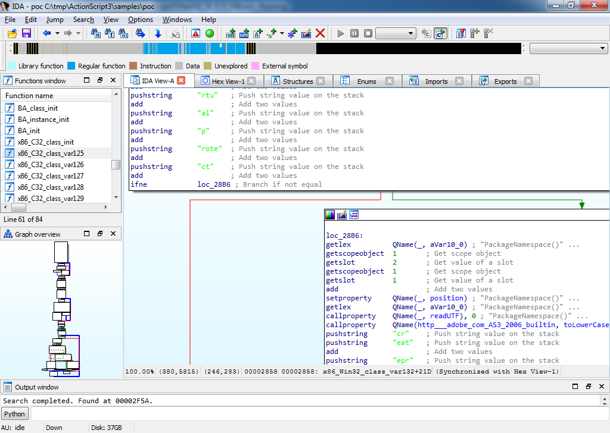
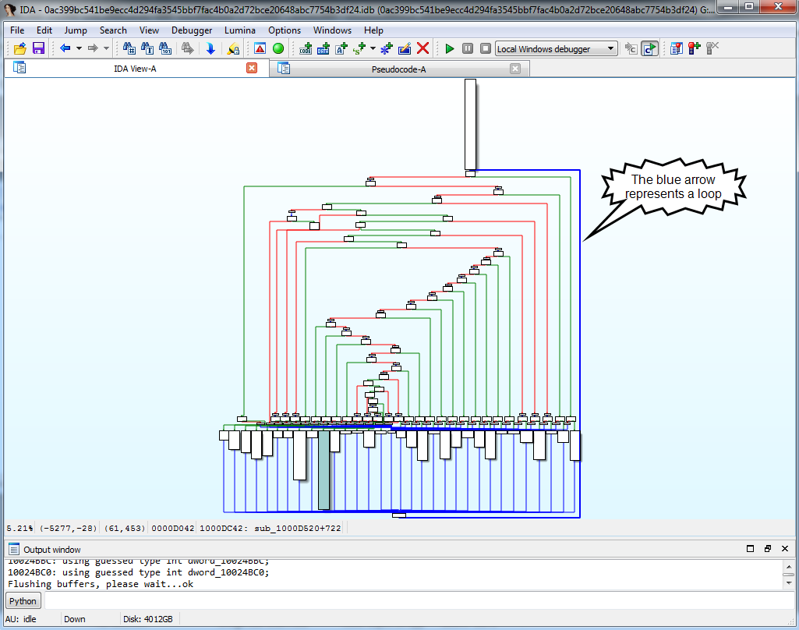

# Hex-Rays Plugin Contest Results 2018

This year, we have examined the plugins of 9 contestants, of wildly varying scopes & focus. The overall quality of this edition was very high, and many entries stood out, each one on different points.

The choice was difficult, but we finally picked the following winners:

*   First prize (3000 USD): [IDArling](#idarling), by Alexandre Adamski and Joffrey Guilbon
*   Second prize (2000 USD): [IDA-Minsc](#idaminsc), by Ali Rizvi-Santiago (Cisco/Talos) [HexraysDeob](#hexraysdeob), by Rolf Rolles (Möbius Strip Reverse Engineering)
*   Third prize (1000 USD): [HeapViewer](#heapviewer), by Daniel García Gutiérrez

Congratulations to the winners!

Below is the full list of submissions:

# ActionScript 3 
by Boris Larin (Kaspersky Lab)

ActionScript 3 is:
    
> … an ActionScript 3 processor module and Flash debugger plugin.

**Our comments:**

The submission from Boris Larin of Kaspersky Labs is actually three-in-one: a loader, processor module, and a debugger helper plugin.

It helps analyzing and debugging Adobe Flash flies. Although Flash has a planned End-Of-Life in 2020, it still remains a popular target for exploits and is still availble for most browsers.

We’ve already had an Adobe Flash disassembler submission back in 2009 (our first contest!) but that plugin only supported ActionScript2 and it has not been ported to IDA 7.0 which limits its usability.

The new loader/processor module from Boris supports ActionScript3 which is much more common nowadays and transparently loads compresssed files (CWS signature) which required manual decompression with the old one. In addition, there is a debugger helper plugin which allows the user to debug JITted *native code* generated by the Flash runtime from the bytecode methods and also adds comments with the original bytecode for easier understanding. This plugin will be very useful for anyone analyzing Flash exploits in malware. Impressive work from Boris!



**[Download ActionScript3.zip](PlugIn/ActionScript3.zip)**

# HeapViewer 
by Daniel García Gutiérrez

HeapViewer is:

> … an IDA Pro plugin to examine the heap (glibc malloc implementation), focused on exploit development.

**Our comments:**

HeapViewer is a plugin to examine the heap of a process running under Linux, specifically glibc’s heap management implementation.

It is a great tool for exploit development (its primary purporse), and also for learning how glibc’s heap management is implemented.

The plugin provides an organized and in-depth view of the structures being used by glibc to manage the heap. HeapViewer looks like a great tool to have during CTF challenges.

It integrates well with IDA’s debugging API to implement a tracer for memory-related functions.

HeapViewer is focused on exploit development, but it could be expanded to provide more memory-related analysis functionalities.


**[Download heap-viewer.zip](PlugIn/heap-viewer.zip)**

**[Get HeapViewer from github](https://github.com/danigargu/heap-viewer)**

# HexraysDeob 
by Rolf Rolles (Möbius Strip Reverse Engineering)

Deobfuscating Decompiler Plugin is:

> … a Hex-Rays microcode API plugin breaking an obfuscating compiler used to create an in-the-wild malware family. The plugin is fully automatic and requires no user intervention; upon installation, the decompilation listings presented to the user will be free of obfuscation.

**Our comments:**

HexRaysDeob is not a large plugin, less than 4000 lines of C++ code but it performs a very complex task of handling heavily obfuscated code. It uses the decompiler’s microcode API to automatically detect obfuscated functions, to remove the opaque predicates, and to unflatten the control flow.

In the current state the plugin handles one specific malware but can be relatively easily generalized to detect similar obfuscation techniques and remove them. In general, it detects a switch and a loop that are used to artificially flatten the control flow:



and removes them, so that we have nice control flow:


The plugin will be extremely useful to all persons interested in the microcode API because it is thouroughly commented.

**[Download HexRaysDeob.rar](PlugIn/HexRaysDeob.rar)**

https://github.com/RolfRolles/HexRaysDeob
# Hyara 

by Yi Hyun, Kwak Kyoung-Ju (Korea Financial Security Institute)

Hyara is:

> … a plugin to create pattern-matching rules.

**Our comments:**

Hyara is a plugin created by Yi Hyun and Kwak Kyoung-ju.

It helps creating rules for the YARA pattern-matching tool direcly in IDA. It includes a simple detection of relocatable bytes in x86 opcodes for improved matching. It also provides a checker feature for testing the rules on the loaded binary.


**[Download Hyara.zip](PlugIn/Hyara.zip)**

https://github.com/hyuunnn/Hyara

# IDAFuzzy 

by Ga-Ryo

IDAFuzzy is:

> … a fuzzy search tool for IDA Pro. This tool helps you to find command/function/struct and so on. This tool is inspired by Mac’s Spotlight and Intellij’s Search Everywhere dialog.

**Our comments:**

The tool is simple and works as advertized. This global search feature is more and more implemented in various softwares, and this plugins makes it available from IDA. Solid foundations are there and the plugin is already useful and usable, especially as it can be operated with the keyboard. There is still room for improvement though.


**[Download IDAFuzzy.zip](PlugIn/IDAFuzzy.zip)**

https://github.com/Ga-ryo/IDAFuzzy

# IDA-Minsc 

by Ali Rizvi-Santiago (Cisco/Talos)

IDA-Minsc is:

> … a plugin for IDA Pro that assists a user with scripting the IDAPython plugin that is bundled with the disassembler. This plugin groups the different aspects of the IDAPython API into a simpler format which allows a reverse engineer to script different aspects of their work with very little investment.

**Our comments:**

IDA-Minsc is a big Python plugin, and Python zealots will like it! First, because it is written in Python, and second, it makes many things much more Pythonic than they were initially. IDA initially exposes C++ like API, which is too wordy and cumbersome for everyday hacking. IDA-Minsc introduces very short and handy functions and classes to overcome this shortcoming, and it looks neat! For example, instead of writing

```
idaapi.is_code(idaapi.get_flags(here()))
```

you just write

```
is_code()
```

and it will conveniently use some reasonable defaults.

It also introduces ‘tags’, which can be used to store and retrieve arbitrary info in the database as comments. The user can use various tags to mark a subset of functions and perform operations on them. By the way, all comments become searchable because of this feature. Think of it as about a small database inside idb, implemented on top of function and instruction comments.

The plugin comes with extensive documentation and has tutorials. It is a mature plugin, and will be useful in everyday work. We liked this plugin, it is very simple to install and definitely can make the user’s life much easier.


**[Download ida-minsc.zip](PlugIn/ida-minsc.zip)**

**[Get IDA-Minsc from github](https://github.com/arizvisa/ida-minsc)**


# IDArling 
by Alexandre Adamski and Joffrey Guilbon

IDArling is:

> … a collaborative reverse engineering plugin for IDA Pro and Hex-Rays.

**Our comments:**

On one hand, this is yet another attempt to solve the problem of multiple users working on the same database. On the other hand, this plugin can really be useful if deployed and used correctly. Due to the architecture of IDA it is very difficult to keep all database copies in sync:

*   there are always ways to modify a database without generating an event. in such a case other copies of IDA won’t be informed about the change.
*   different sets of third-party plugins (or their configuration) may lead to differences in the database contents.
*   programming bugs, both in IDA and the synchronization plugin, may lead to inconsistencies.
*   finally, the analysis queue may interfere with the synchronization plugin and lead to desynchronization.

Nevertheless, with some discipline, multiuser work is still possible with a plugin like IDArling. Say, introduce the following user policy: one copy of IDA is denoted as the main (may I say “master”?) copy, and only this copy of IDA will save the database to the server. Work of other users won’t be lost because their changes are instantaneously copied to the main IDA.

We liked the way the plugin works. It shows the current address of other users in the navigation band and in the disassembly. This helps users to know where other users are and organize their work to avoid clashes (for example, to avoid renaming the same function simultaneously).

Since this is the version 0.0.1 of the plugin, there are many shortcomings but hopefully they will be fixed as time goes. Even in the current state the plugin can be useful.

**[Download IDArling.zip](PlugIn/IDArling.zip)**

**[Get IDArling from github](https://github.com/IDArlingTeam/IDArling)**


# NIOS2 

by Anton Dorfman (Positive Technologies)

NIOS2 is:

> … an IDA Pro processor module for Altera Nios II Classic/Gen2 microprocessor architecture.

**Our comments:**

The NIOS II processor module plugin by Anton Dorfman does exactly what you would expect it to do.

This plugin is written in Python and implements a complete processor module for the NIOS II Altera softcore, including pseudo-instruction simplification, stack variables, offsets relative to the global pointer, custom instructions, cross-references, switch detection, and many other features.


The code is well written and can be easily modified if your softcore contains extra custom instructions.

Usage is very straight-forward. Just copy the file to your “procs/” directory and, in the file loading dialog, select “Altera Nios II Classic/Gen2 Processor”. IDA’s ELF loader does not implement the particularities of this machine (such as relocations), but it can nonetheless load the files if the processor module is selected.

This plugin is of great benefit for people working with Altera’s FPGAs. Perhaps now a NIOS II debugger could be written as well.

**[Download nios2_proc.7z](PlugIn/nios2_proc.7z)**

https://github.com/ptresearch/nios2

# Oregami 

by Matan Ziv

Oregami is:

> … a plugin analyzing the current function to find the usage frame of registers.

**Our comments:**

Oregami eases the work when tracking the use of a register within a function, by limiting the search to occurrences related to the one currently highlighted instead of the whole function. It provides handlers for PPC and ARM processors (the design is modular enough for others to be implemented), while more generic routines handle other CPU types, but with poor results. The approach taken by the module is quite simplistic and can fail on some complex cases.


**[Download oregami.zip](PlugIn/oregami.zip)**

https://github.com/shemesh999/oregami

# Final notes

As always, many thanks to all the participants for their useful and interesting submissions. We are looking forward to the next contest!

**The usual disclaimer**

Please be aware that all files come from third parties. While we did our best to verify them, we cannot guarantee that they work as advertised, so use them at your own risk.

For the plugin support questions, please contact the authors.

Date: September 21st, 2018

All entries and winners from the other years can be viewed below: