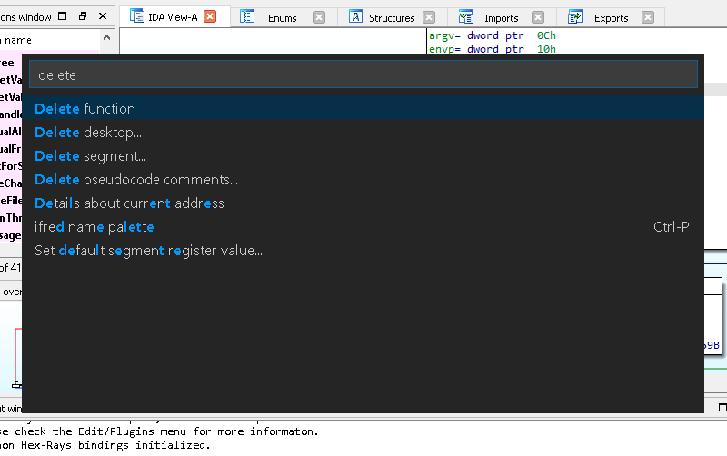

# Hex-Rays Plugin Contest Results 2019

This year again, we have examined the plugins of 9 contestants,  
and once again the scope, and focus of the plugins we examined  
is very broad. Almost all of the plugins were written Python,  
which seems to be a solid trend.

Here is our pick for the winners:

*   First prize:  
    [Karta](#karta), by Eyal Itkin
*   Second prize:  
    [deREferencing](#dereferencing), by Daniel Garcia Gutierrez
*   Third prize:  
    [idapkg](#idapkg), by jinmo123

Congratulations to the winners!

Below is the full list of submissions:

# BRUTAL IDA 
by Tamir Bahar
    
> BRUTAL IDA restores your original workflow by blocking the **undo** and **redo** keyboard shortcuts.
    
**Our comments:**

Tamir Bahar’s plugin is a good reminder that, whatever the reason,  
people don’t like their workflows broken.

While plugins typically tend to add functionality, this one is here  
to remove some: nostalgia is a very powerful feeling indeed! (or  
is it Stockholm Syndrome?)

**[Download BRUTAL-IDA-master.zip](PlugIn/BRUTAL-IDA-master.zip)**

**[Get BRUTAL IDA from github](https://github.com/tmr232/BRUTAL-IDA)**

# CFG Inquisitor 

by Brenda So

CFG Inquisitor:  

> […] checks the validity entry and exit blocks of control flow graphs (CFGs)

**Our comments:**

CFG Inquisitor essentially restricts what can be considered a  
valid entry-, or exit-point of a function.

This is a fairly small plugin, with what appears to be somewhat  
specific heuristics. It’s unclear whether it would be reasonable  
to extend these to all binaries that IDA can analyze.

The plugin is still under active development, and doesn’t seem to  
support x86_64 at this point.

**[Download cfg_inquisitor.zip](PlugIn/cfg_inquisitor.zip)**

# deREferencing 
by Daniel Garcia Gutierrez

deREferencing is an:  

> IDA Pro plugin that implements more user-friendly register and stack views

**Our comments:**

deReferencing is an IDA Pro plugin that implements new registers and stack views.  
Adds dereferenced pointers, colors and other useful information, similar to some GDB plugins (e.g: PEDA, GEF, pwndbg, etc).

Supports x86, x86-64, ARM, ARM64, MIPS32 and MIPS64

The plugin adds custom views that try to interpret values in registers and stack as pointers  
and automatically dereference them. Values are colored depending on the type of memory they belong to.

It is robust, useful, easy to install and use. The code is nicely modularized and readable.

**[Download deREferencing-master.zip](PlugIn/deREferencing-master.zip)**

**[Get deREferencing from github](https://github.com/danigargu/deREferencing)**

# findrpc 
by Lucas Georges

findrpc is an:  

> Idapython script to carve binary for internal RPC structures

**Our comments:**

findrpc.py is a single-file script which tries to find Windows RPC server and client descriptions in PE binaries.

The target audience is somewhat small but apparently RPC is an underexplored part of Windows so it’s  
a promising area for finding previously unknown vulnerabilities.

The declared feature list is quite impressive:

*   View in a glance which RPC clients and servers are embedded in the binary
*   Locate dispatch tables for RPC servers
*   Quicky rename every RPC proc handlers found
*   (On Windows) Generate decompiled IDL from RPC declarations

Unfortunately in our tests it only worked reliably on some binaries and it was  
difficult to diagnose why exactly it failed on others, so there is definitely room for improvement.

For displaying results, the authors opted out for native Qt widgets as opposed to IDA’s standard choosers  
so, for example, copying the text from the result list did not work as it was not implemented

IDL decompilation feature uses a separate Windows binary without source code which is not always convenient.

That said, when it did work, the results were nice and useful  
for finding hidden interfaces in Windows binaries

**[Download findrpc-master.zip](PlugIn/findrpc-master.zip)**

**[Get findrpc from github](https://github.com/lucasg/findrpc)**

# ifred 
by jinmo123

ifred is:  

> IDA command palette & more

**Our comments:**

Ifred is a palette like we have seen several ones. It performs a fuzzy search  
on IDA commands and on names from the current database. Compared to other  
solutions, we like the attractive, customizable look. It also lets you create  
your own palettes.

**[Download ifred.zip](PlugIn/ifred.zip)**

**[Get ifred from github](https://github.com/Jinmo/ifred)**

# idapkg 
by jinmo123

idapkg is:  

> Packages for IDA Pro

**Our comments:**

Idapkg tackles the problem of installing IDA plugins and managing their  
dependencies. Based on an [online repository](https://idapkg.com/),  
it will let you search for packages and install or uninstall them. This is  
still a proof of concept, but is an interesting step towards an easy and standard  
way of installing IDA plugins.

**[Download idapkg.zip](PlugIn/idapkg.zip)**

**[Get idapkg from github](https://github.com/Jinmo/idapkg)**

# Karta 
by Eyal Itkin

Karta is:  

> an IDA Python plugin that identifies and matches open-sourced  
> libraries in a given binary. The plugin uses a unique technique  
> that enables it to support huge binaries (>200,000 functions),  
> with almost no impact on the overall performance.

**Our comments:**

Karta really is a composite of a few things:

*   the _ThumbsUp_ plugin, which helps recovering functions in  
    ARM binaries, where IDA falls short
*   the _identifier_ that identifies what open source libraries  
    were compiled in, and with what version (e.g., from identifier strings)
*   the _matcher_, which will match functions coming from  
    the previously-identified libraries

Thumbs Up in and of itself is a rather significant achievement since  
it uses machine learning to recover what appears to be functions,  
that IDA didn’t spot, and it appear to be doing a very good job with  
ARM binaries.

For the rest of its work, Karta will use an approach that differs from FLIRT  
(and other tools) in quite a few aspects:

*   it will only try to match functions from a library if the identifier  
    identified that the library is be present in the file,
*   it will use many heuristics to determine the “likeliness” of  
    function presence, based on where they are in the file

Running the plugin can take a significant amount of time (it’s written in  
Python), but the results can be very satisfying.

For the record, Karta has quite a few dependencies, so be sure  
those are installed, and reachable through `sys.path`:

*   awesomelib
*   Cute
*   decorator
*   elementals
*   hexdump.py
*   networkx (use version 2.2: newer versions require Python3.)
*   Sark
*   sklearn

**[Download Karta-master.zip](PlugIn/Karta-master.zip)**

**[Get Karta from github](https://github.com/CheckPointSW/Karta)**

# SMS-IDA 
by Edward Larson

SMS-IDA is:  

> The plugin allows IDA API commands to be run from your phone, anywhere!  
> (Provided you have cell service).

**Our comments:**

We have hard time imagining someone controlling his IDA with SMS messages but  
if there are any desperate souls that need such a functionality,  
this plugin is right for you.

A bit of set up that includes installing  
some python packages, registering on an online web site that handles  
SMS messages, and punching a hole in your firewall, and you are ready to go.

Just be informed any person who happens to know where to send SMS messages to  
will be able to participate, for example, like this:

**[Download sms-ida.tar](PlugIn/sms-ida.tar)**

# Virtuailtor 
by Gal Zaban

Virtuailtor is:  

> an IDAPython tool for C++ vtables reconstruction on runtime.

**Our comments:**

The script does not require any installation, so to use it, just press  
Alt-F7 and select the **Main.py** file. It will add tons of breakpoints  
to your database and then once you run the target application using  
a debugger backend of your choice, it will create C++ virtual tables.  
Naturally, the application will execute slower than usual because of the  
breakpoints. Besides of creating virtual tables the script also adds cross  
references to the called functions.

It supports x86, x64, and Aarch64.

We like the idea, it has a great potential.  
Hopefully the author will continue to improve the script.

**[Download Virtuailor-master.zip](PlugIn/Virtuailor-master.zip)**

**[Get Virtuailtor from github](https://github.com/0xgalz/Virtuailor)**

**Final notes**

As always, many thanks to all the participants for their useful and interesting submissions.  
We are looking forward to the next contest!

**The usual disclaimer**

Please be aware that all files come from third  
parties. While we did our best to verify them, we cannot  
guarantee that they work as advertised, so use them at your own risk.

For the plugin support questions, please contact the authors.

Date: September 23rd, 2019

All entries and winners from the other years can be viewed below: