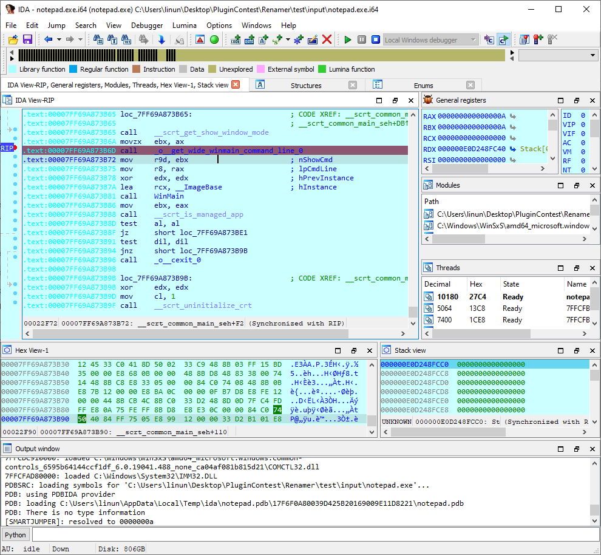

> 原文地址 [hex-rays.com](https://hex-rays.com/contests_details/contest2020/)

This year, we have received a record 17 submissions! We thank all the participants for their hard work and contribution. After having analyzed and deliberated about all the submitted plugins, we have decided to award the following prizes:

First prize [DynDataResolver](#dyndataresolver)

Second prize [Lucid](#lucid) and [grap](#grap)

Third prize [efiXplorer](#efixplorer)

# Full list of submissions

*   [bf](#bf)
*   [bip](#bip)
*   [capa explorer](#capa-explorer)
*   [DynDataResolver](#dyndataresolver)
*   [efiXplorer](#efixplorer)
*   [FingerMatch](#fingermatch)
*   [grap](#grap)
*   [idaDiscover](#idadiscover)
*   [idahunt](#idahunt)
*   [ida_medigate](#ida_medigate)
*   [idapm](#idapm)
*   [Lucid](#lucid)
*   [PacXplorer](#pacxplorer)
*   [PETree](#petree)
*   [qiling](#qiling)
*   [Renamer](#renamer)
*   [SmartJump](#smartjump)

# bf
Milan Boháček

[bf.zip](PlugIn/bf.zip)

> `Bf_proc.py` adds brainfuck language to the Hex-Rays decompiler.

**Our opinion:** Using a set of clever tricks (and an impressive understanding of the Hex-Rays APIs), Milan manages to turn brainfuck code into pseudocode. The plugin is not entirely stable (and can even crash IDA), but the very idea of it, and the fact that it can actually provide results (arguably not in all cases) are, in and of themselves, enlightening.

# bip
Bruno Pujos, Synacktiv

[bip-master-20200909.zip](PlugIn/bip-master-20200909.zip)

https://github.com/synacktiv/bip/

> Bip is a project which aims to simplify the usage of Python for interacting with IDA. Its primary goal is to facilitate the use of Python in the interactive console of IDA and the writing of plugins

**Our opinion:** Bip is a layer on top of the IDAPython APIs, that adds, among other things, more ‘pythonic’ classes (the IDAPython APIs draw inspiration from the C/C++ SDK, and are understandably too low-level to the taste of some users) and a lot of documentation that will, no doubt, be very appreciated, especially by new IDA & IDAPython users. The plugin is trivial to install, and thanks to the documentation & examples, you can get started using it in no time.

# capa explorer

Mike Hunhoff, Willi Ballenthin, Moritz Raabe – FLARE Team (FireEye/Mandiant)

[capa.zip](PlugIn/capa.zip)

https://github.com/fireeye/capa/

> capa explorer is an IDA Pro plugin written in Python that integrates the FLARE team’s open-source framework, capa, with IDA. capa is a framework that uses a well-defined collection of rules to identify capabilities in a program.

**Our opinion:** A very well-written plugin, resting on a robust collection of rules that will no doubt make the lives of many malware researchers all around the world simpler. Relying purely on static analysis, it doesn’t require running the binary being analyzed at all to get a quick first glance about its features. Installation is painless, the UI is clean, and running the plugin is reasonably fast.

# DynDataResolver
[Holger Unterbrink](https://twitter.com/hunterbr72) (Cisco Talos)

[ddr_installer.zip](PlugIn/ddr_installer.zip)

https://github.com/Cisco-Talos/DynDataResolver

> DDR is an IDA plugin that instruments binaries using the DynamoRIO framework.

**Our opinion:** The idea behind DDR is to help extract the interesting bits of information from a running piece of software.

DDR is a complex and robust plugin that uses the client-server architecture to protect the researcher from the executed malware. Despite the complexity of the setup, the installation procedure is extremely smooth, on par with commercial products.

The plugin comes with an introductory video and a set of sample files. They greatly simplify the first use of the plugin and give a good understanding of the plugin functionality.

# efiXplorer
[Alex Matrosov](https://twitter.com/matrosov/), [Andrey Labunets](https://twitter.com/isciurus), [Philip Lebedev](https://twitter.com/p41ll), [Yegor Vasilenko](https://twitter.com/yeggorv)

[efiXplorer.zip](PlugIn/efiXplorer.zip)

https://github.com/binarly-io/efiXplorer

> IDA plugin for UEFI firmware analysis and reverse engineering automation

**Our opinion:** efiXplorer is a priceless tool for anyone wishing to perform UEFI firmware analysis: its loader will first unpack all the contained UEFI firmware modules, then bring them together into a single IDB, performing all the dirty work of resolving pointers across module boundaries, and creating xrefs in all the critical places.

The documentation is relatively terse, but that is understandable given its target audience (UEFI experts.)

# FingerMatch
Jan Prochazka

[fingermatch-base-200907.zip](PlugIn/fingermatch-base-200907.zip)

https://github.com/jendabenda/fingermatch

> FingerMatch is an IDA plugin for collecting functions, data, types and comments from analyzed binaries and fuzzy matching them in another binaries.

**Our opinion:** FingerMatch lets the user export “metadata” (comments, prototypes, …) coming from an IDB to a file, and import that file in another IDB. This plugin is somewhat reminiscent of IDA’s “Lumina” feature, but the key differences are that FingerMatch works with files instead of a server, and differs in how the function matching is performed.

# grap
[Aurélien Thierry](https://twitter.com/yaps8) (QuoSec), Jonathan Thieuleux, Léonard Benedetti

[grap-1.3.1.zip](PlugIn/grap-1.3.1.zip)

https://github.com/QuoSecGmbH/grap/

> grap is a tool to match binaries at the assembly and control flow level (for instance: a loop on a basic block containing a xor)

**Our opinion:** grap lets you write matching rules (in the ‘DOT’ graph description language), that will then be used to automate the detection of certain specific features in the binary (such as suspicious evasion tricks), and classify samples. If this reminds you of another plugin, `capa`, it’s understandable: they seem to have similar goals. Our testing revealed that while it appears that capa rules are overall somewhat simpler to write, grap rules might actually be more flexible.

# idaDiscover
Javier Vicente Vallejo

[idaDiscover.7z](PlugIn/idaDiscover.7z)

> idaDiscover is essentially a toolbox to assist malware analysis. It can do many things: find encrypted or dynamically strings, embedded PE files, suspicious loops, crypto or hash routines, and so on.

**Our opinion:** The target audience for idaDiscover seems to be mostly Windows malware researchers, by automating extraction of some hidden features of binaries (such as encrypted strings, embedded PE files, encryption, …). Although the user interface can be a bit hairy at times, idaDiscover is full of features that help getting the most usual evasion tricks out of the way, for further analysis. idaDiscover is well documented, in particular by the introductory videos that come with it.

# idahunt
Aaron Adams, Cedric Halbronn (NCC Group)

[idahunt.zip](PlugIn/idahunt.zip)

https://github.com/nccgroup/idahunt

> idahunt is a framework to analyze binaries with IDA Pro and hunt for things in IDA Pro. It is a command-line tool to analyze all executable files recursively from a given folder.

**Our opinion:** Although it doesn’t quite qualify as an IDA plugin, idahunt is revealing what some of our users need to use IDA for, on a regular basis. In this particular case, automating the process of seeking for specific things in a bunch of files all at once. idahunt can also run IDA instances, passing them a specific script to run, in order to automate the retrieval of information. It also provides some interesting IDAPython helper functions in ida_helper.py. This is a very handy tool to have at your disposal!

# ida_medigate
Uriel Malin

[ida_medigate.tar.gz](PlugIn/ida_medigate.tar.gz)

https://github.com/medigate-io/ida_medigate

> …C++ plugin for IDA Pro

**Our opinion:** Contrary to one might think, ida_medigate is not written in C++: it is written to help C++ reverse engineering, and in particular virtual methods dispatching (the plugin is actually written in IDAPython.) ida_medigate supports parsing of RTTI information (currently only G++ RTTI is supported, but this should be extensible fairly simply), and uses interesting tricks to simplify the user’s work when it comes to resolving the actual virtual method that’s going to be called.

# idapm
Taichi Kotake

[idapm.zip](PlugIn/idapm.zip)

https://github.com/tkmru/idapm

> idapm is IDA Plugin Manager.

**Our opinion:** idapm is there to help users in the (sometimes) tricky task of managing plugins: adding them, removing them, listing them. Much like [idapkg](https://www.hex-rays.com/contests_details/contest2019/#idapkg) last year, idapm is one more bit of evidence that IDA would really benefit from a full-fledged package manager.

# Lucid
[Markus Gaasedelen](https://twitter.com/gaasedelen)

[lucid-0.1.1.zip](PlugIn/lucid-0.1.1.zip)

https://github.com/gaasedelen/lucid

> Lucid is a developer-oriented IDA Pro plugin for exploring the Hex-Rays microcode.

**Our opinion:** The first great feature of Lucid, is that it keeps a correspondence (using background highlighting) between the actual pseudocode displayed in IDA, and the microcode that it shows. But it doesn’t stop there: it also lets the user pick any microcode instruction, and switch between the different ‘maturity levels’ that the microcode goes under during decompilation, to see what became of that instruction at another level. This plugin is a spectacularly useful tool for understanding how the decompiler plugins work, and how to best interact with them (especially programmatically, through the use of hooks/notifications.)

# PacXplorer

Ouri Lipner (Cellebrite Security Research)

[pacxplorer.zip](PlugIn/pacxplorer.zip)

> PacXplorer analyzes ARM64 PAC instructions to provide a new type of cross-reference: from call site to virtual function, and vice versa.

**Our opinion:** PacXplorer will be a great help to IDA users wishing to work on any binary that uses Apple’s “Pointer Authentication Code (PAC)” feature, by analyzing every PAC-enabled virtual method call site, and using the information it finds there to resolve the target method and show cross-references there. This makes it much easier to reverse engineer PAC-enabled binaries.

# PETree

Tom Bonner (BlackBerry Research and Intelligence Team)

[pe_tree-master.zip](PlugIn/pe_tree-master.zip)

https://github.com/blackberry/pe_tree

> PETree is a Python module for viewing Portable Executable (PE) files in a tree-view

**Our opinion:** PETree provides an intuitive (and pretty) user interface and lets one explore everything down to the last bit of information present there. It also provides the ability to dump in-memory regions as PE files, which can be very useful when reversing packed (or encrypted) malware using debugging.

# qiling

ChenXu WU, ZiQiao KONG and Qiling.io Team

[qlingida.py](PlugIn/qlingida.py)

https://raw.githubusercontent.com/qilingframework/qiling/dev/qiling/extensions/idaplugin/qilingida.py

> …an advanced binary emulator with instrumentation plugin for IDA

**Our opinion:** The Qiling IDA plugin bridges the Qiling binary emulation framework with IDA, and lets you inspect registers & stack almost as if you were performing an actual debugging session (but with its widgets, since it is not an actual debugging session.). Ideally, the plugin would implement a debugger backend for IDA, which would let you use IDA’s widgets. But this is already very much usable, and going a promising direction.

# Renamer

Sharon Brizinov

[ResearchTools-master.zip](PlugIn/ResearchTools-master.zip)

https://github.com/ClarotyICS/ResearchTools/tree/master/IDA/Renamer

> For each function [Renamer] shows you what are the available strings and let you choose what is the appropriate name for the function.

**Our opinion:** Renamer is one of those helpful tools that, depending on your typical workflow with IDA, can save you hours of work by partially automating a task that could otherwise be tedious to perform manually. The plugin is trivial to install, and the code easy to understand. (alas, it will currently refuse to work if no Hex-Rays decompiler is unavailable, which we believe is an oversight.)

# SmartJump

Adam Prescott (PwC)

[SmartJump.7z](PlugIn/SmartJump.7z)

https://github.com/PwCUK-CTO/SmartJump

> SmartJump is designed to improve the ‘g’ keyboard shortcut in IDA, especially when using IDA to debug binaries.

**Our opinion:** SmartJump adds to the list of features that IDA’s standard ‘g’ command already provides, by bringing the ability to de-reference registers & memory during debugging. It then becomes possible to write powerful expressions such as: `[rsp] + ebx`, which can prove very handy indeed!

# Final notes

As always, many thanks to all the participants for their useful and interesting submissions. We are already looking forward to the next contest!

Please be aware that all files come from third parties. While we did our best to verify them, we cannot guarantee that they work as advertised, so use them at your own risk.

For plugin support questions, please contact the authors directly.