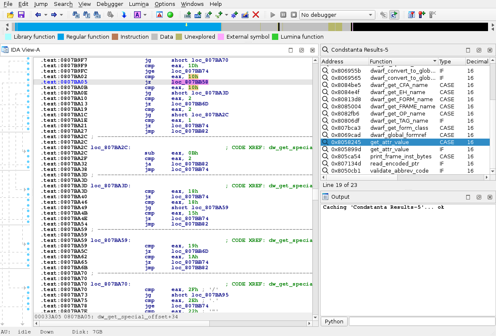
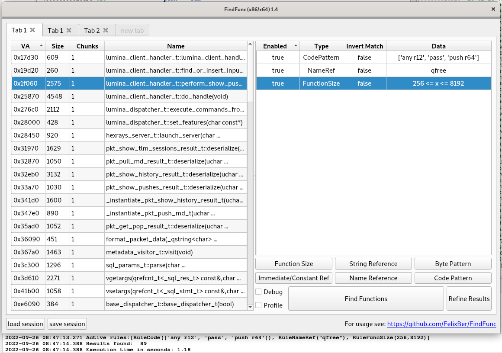
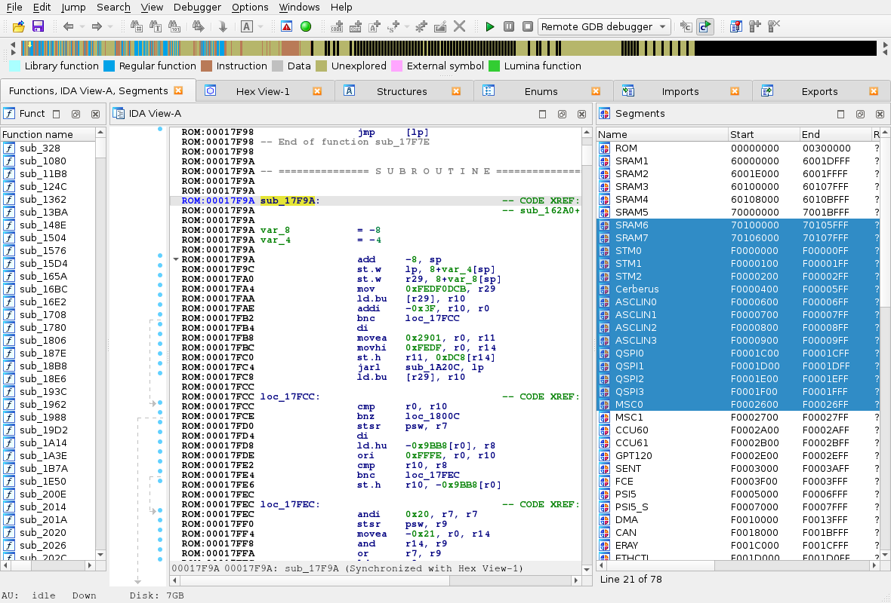
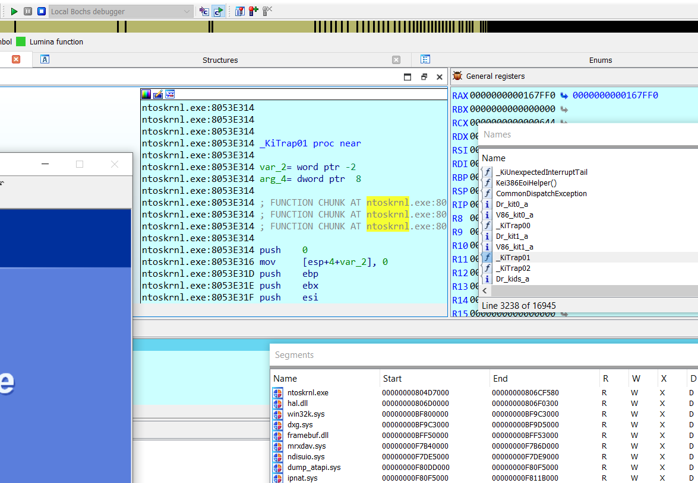
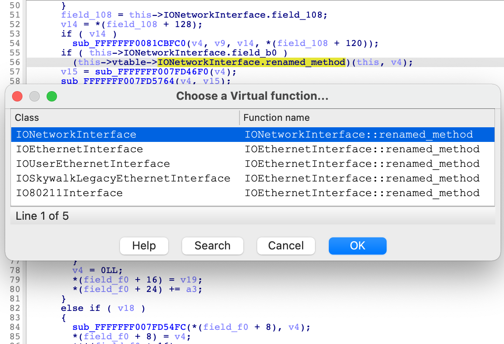
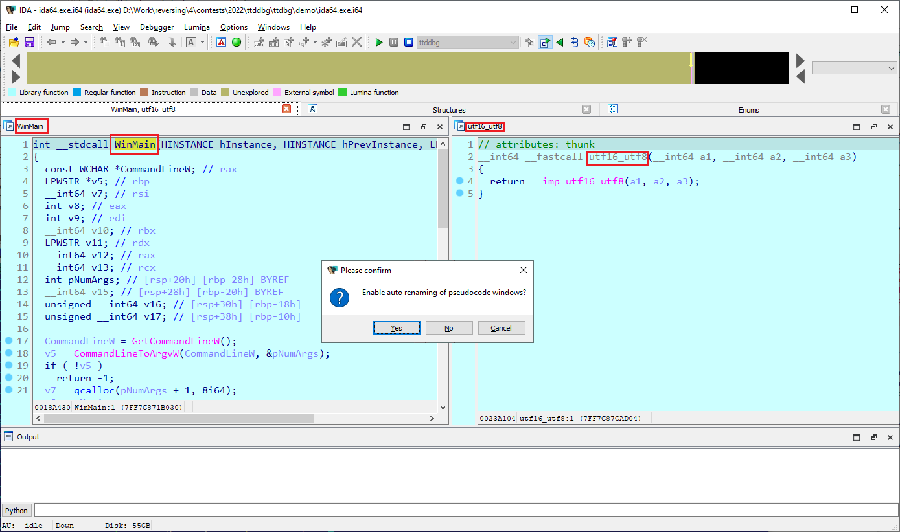
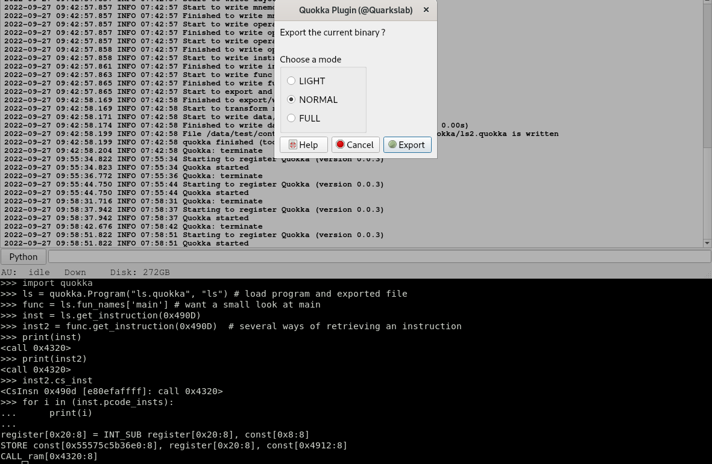
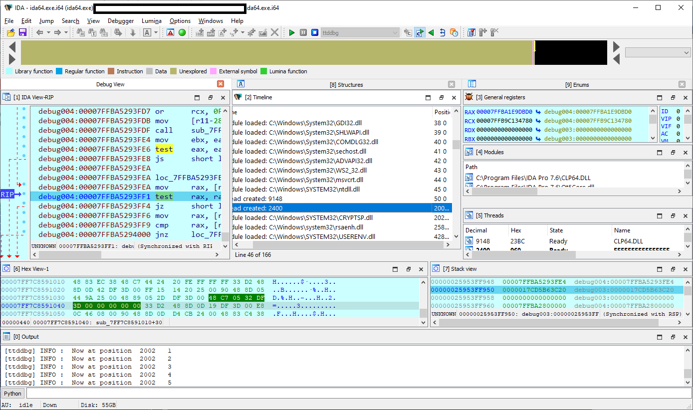
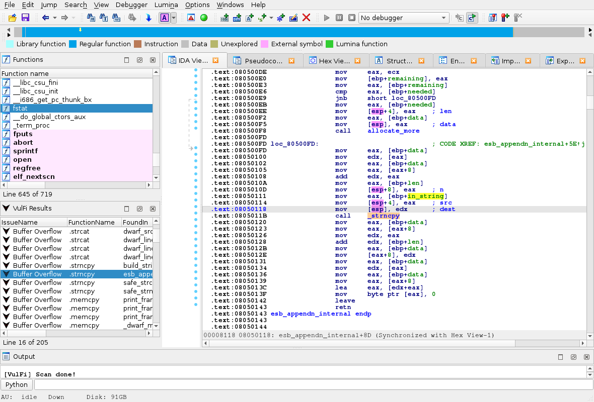

# 2022 Plug-In Contest

We received 9 interesting submissions this year! As usual, many thanks to all the participants for their hard work, and interesting ideas. After having analyzed and deliberated about all the submitted plugins, our panel of judges selected the following winners:

1. **First prize**: [ttddbg](#ttddbg)
2. **Second prize**: [ida_kcpp](#ida_kcpp)
3. **Third prize**: [FindFunc](#FindFunc)

## Full list of submissions

- [Condstanta](#Condstanta)
- [FindFunc](#FindFunc)
- [FirmLoader](#FirmLoader)
- [ida_bochs_windows](#ida_bochs_windows)
- [ida_kcpp](#ida_kcpp)
- [ida_names](#ida_names)
- [Quokka](#Quokka)
- [ttddbg](#ttddbg)
- [VulFi](#VulFi)

## Condstanta

- Martin Petran (Accenture)
- [Condstanta-main.zip](Plugin/Condstanta-main.zip)
- https://github.com/Accenture/Condstanta

> Plugin to search for constants used in conditional statements.

**Our opinion:** A nifty little addition to IDA's search functionality. Use of the decompiler is a nice addition, though it means the search will be slower (in fact, we're seeing more and more of this"augmenting" through analysis of the C-tree in addition to the disassembly.)

The plugin is very easy to install (and self-contained).

## FindFunc

- Felix B.
- [findfunc1.4.zip](Plugin/findfunc1.4.zip)
- https://github.com/FelixBer/FindFunc

> […] an IDA Pro python3 plugin to find/filter code functions that contain a certain assembly or byte pattern, reference a certain name or string, or conform to various other constraints

**Our opinion:** FindFund is a nice plugin offering an easy way to search and maintain list of functions corresponding to a list of rules, including code patterns and byte patterns. Designed for x86/x64 architectures, it can as well by used for other architectures like Risc-V with some limitations. These limitations can easily be removed if you need it. You can have as much search pattern as you want and reuse your patterns for other idb, via the session save and reload.

## FirmLoader

- Martin Petran (Accenture)
- [FirmLoader-main.zip](Plugin/FirmLoader-main.zip)
- https://github.com/Accenture/FirmLoader

> An alternative to SVD loader that uses simpler JSON files

**Our opinion:** This plugin addresses two pain points of using the default SVD plugin:

1.  Reading & writing XML is terrible
2.  Navigating the list of manufacturers/devices in the SVD plugin, is not comfortable.

Though those are indeed annoyances (the 2nd point could be solved by using a tree-like view), this plugin requires to a re-write of the XML files, into their JSON counterpart. Perhaps a converter would be handy (so that the bulk of the conversion work could be automated)?

## ida_bochs_windows

- David Reguera Garcia aka Dreg
- [ida_bochs_window.zip](Plugin/ida_bochs_window.zip)
- https://github.com/therealdreg/ida_bochs_windows

> Helper script for Windows kernel debugging with IDA Pro on native Bochs debugger (including PDB symbols)

**Our opinion:**The plugin adds module and symbol information when debugging Windows in the Bochs emulator. The symbols can be also exported from IDA to a map file to be used inside the Bochs debugger. Such features can be especially useful when using custom builds of Bochs, for example with additional instrumentation.

## ida_kcpp

- Uriel Malin and Ievgen Solodovnykov of Cellebrite Labs
- [ida_kcpp-main.zip](Plugin/ida_kcpp-main.zip)
- https://github.com/cellebrite-labs/ida_kcpp

> An IDAPython module for way more convienent way to Reverse Engineering iOS kernelcaches.

**Our opinion:** If you frequently reverse-engineer iOS kernelcaches, this plugin will almost certainly make your life easier. The plugin utilizes the analysis provided by the well-renowned ida_kernelcache plugin and builds a layer of convenience utilies on top of it. Most notably the plugin makes navigation and function renaming within the C++ IOKit class hierarchy more "IOKit-aware". For example, when renaming a virtual function in the vtable struct for an IOKit class, ida_kcpp will automatically rename the member in all the vtable structs within the class hierarchy, as well as rename the functions themselves. This is extremely convenient when building up the analysis of complex IOKit classes, which might have dozens of superclasses/subclasses, each with their own implementation of the same virtual function. Automating such tasks is not trivial, but the plugin does a great job providing this functionality with minimal effort from the user.

## ida_names

- Pavel Maksyutin (Positive Technologies)
- [ida_names-master.zip](Plugin/ida_names-master.zip)
- https://github.com/archercreat/ida_names

> IDA-names automatically renames pseudocode windows with the current function name. It can also rename ANY window with SHIFT-T hotkey.

**Our opinion:** A small and simple, but potentially very useful plugin. It could be especially useful for those IDA users who open multiple pseudocode windows and then struggle finding the correct one.

## Quokka

- Alexis Challande (Quarkslab/École Polytechnique)
- [quokka.zip](Plugin/quokka.zip)
- https://github.com/quarkslab/quokka

> Quokka is a binary exporter: from the disassembly of a program, it generates an export file that can be used without a disassembler.

**Our opinion:** Quokka is composed of two parts: * an IDA plugin designed to export the most important information provided by IDA autoanlysis quite efficiently * a Python library offering an API to interact with the export and the corresponding binary in a batch mode. You have also an integration with capstone and pypcode to helps you in your RE work.

## ttddbg

- Simon Garrelou, Sylvain Peyrefitte of the Airbus CERT Team
- [ttddbg-1.0.1.zip](Plugin/ttddbg-1.0.1.zip)
- [ttddbg-ida77-1.0.1-win64.msi](Plugin/ttddbg-ida77-1.0.1-win64.msi)
- [ttd-bindings-dc1ee10e9e7a33ee2f39b388e85f5183a2b17c84.zip](Plugin/ttd-bindings-dc1ee10e9e7a33ee2f39b388e85f5183a2b17c84.zip)
- https://github.com/airbus-cert/ttddbg

> ttddbg is a debugger plugin for IDA Pro which can read Time Travel Debugging traces generated by WinDBG or Visual Studio

**Our opinion:** Time Travel Debugging is an extremely powerful feature of the new WinDbg Preview which allows to easily track down the source of crashes and other bugs. Once a trace is recorded, you can observe the whole execution of the program and follow it both forward and backwards, allowing you to "go back in time" to see exactly why the program reached a specific state instead of trying to guess. The plugin offers the familiar debugging exprerience with a few TTD-specific features, making it very easy to use.

## VulFi

- Martin Petran (Accenture)
- [VulFi-main.zip](Plugin/VulFi-main.zip)
- https://github.com/Accenture/VulFi

> A query based function cross-reference finder for vulnerability research

**Our opinion:** VulFi is one more contender in the somewhat long list of tools that assist searching for vulnerabilities. It relies on a set of rules defined in an external file. Those rules will evaluate against parameters data extracted/computed by the plugin.

Just like [Condstanta](#Condstanta) (same author), this plugin makes clever use of the decompiler to refine its analysis.

We found that the code could be made easier to modify, in order to enrich the set of data it makes available to the rules.

