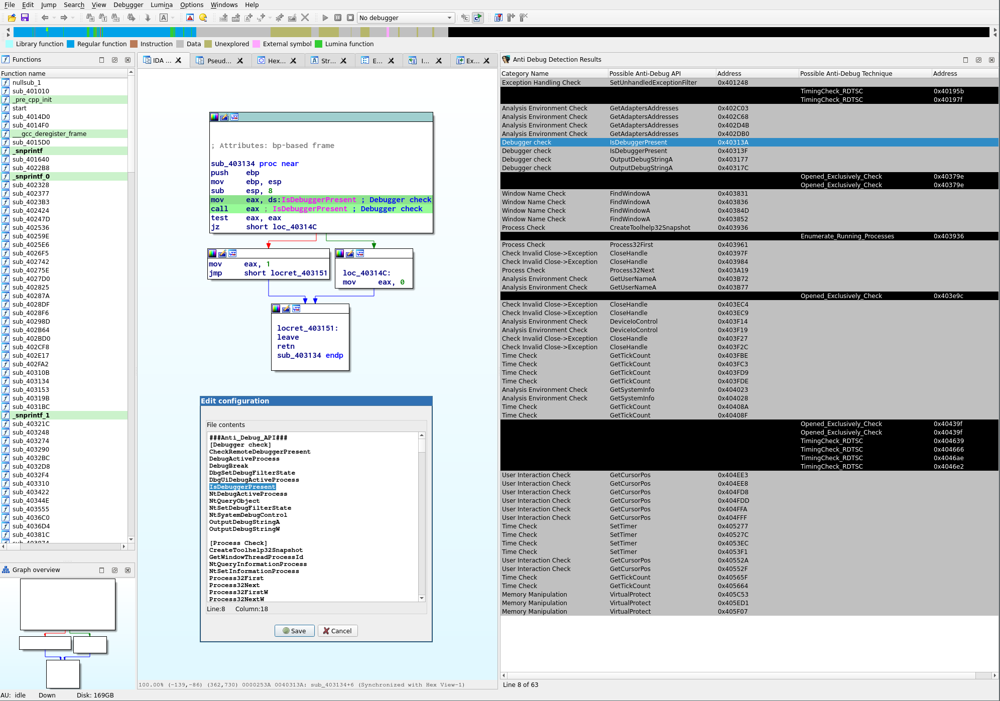
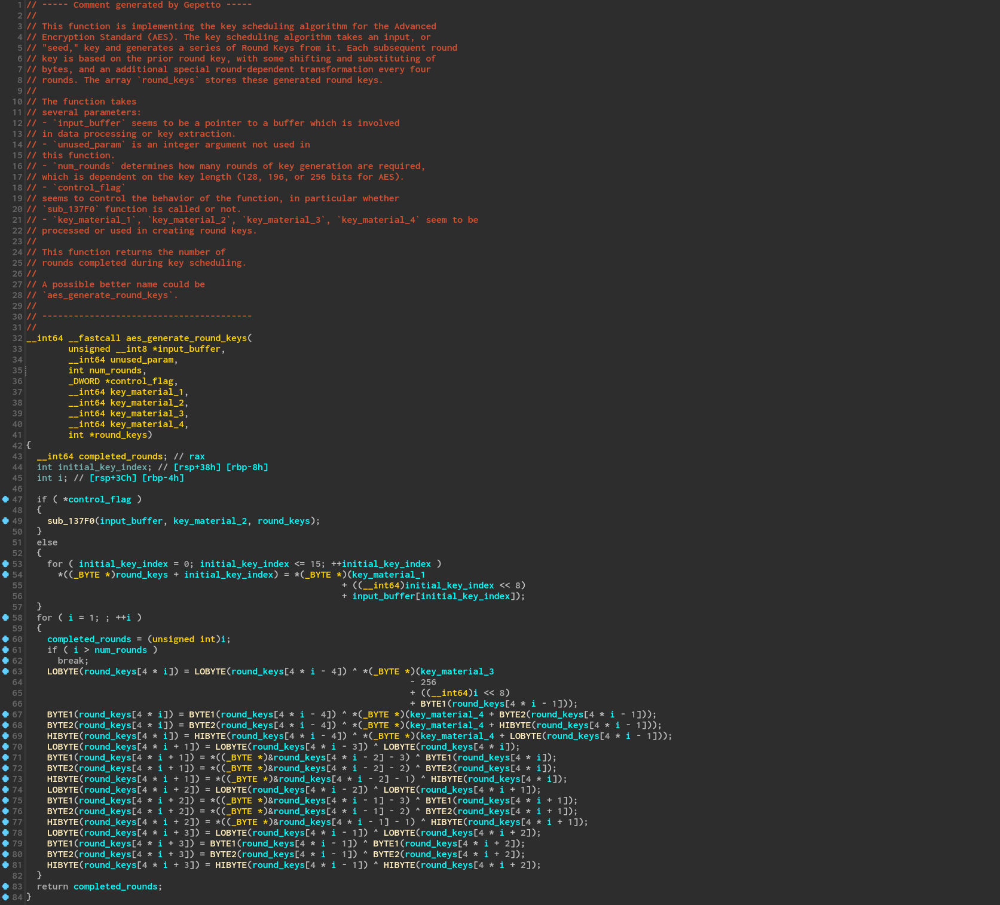
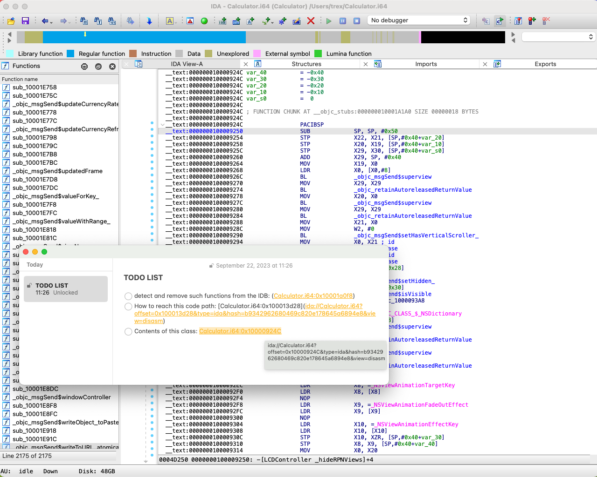
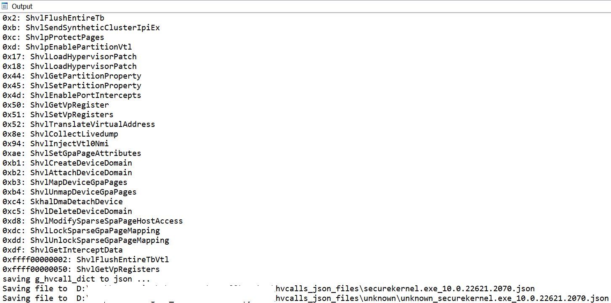
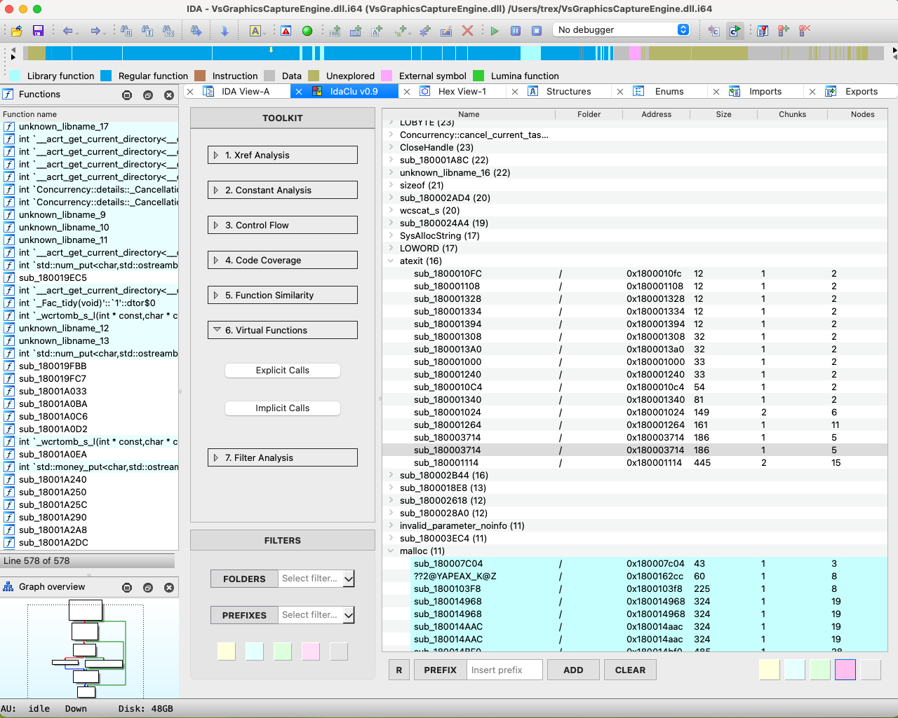
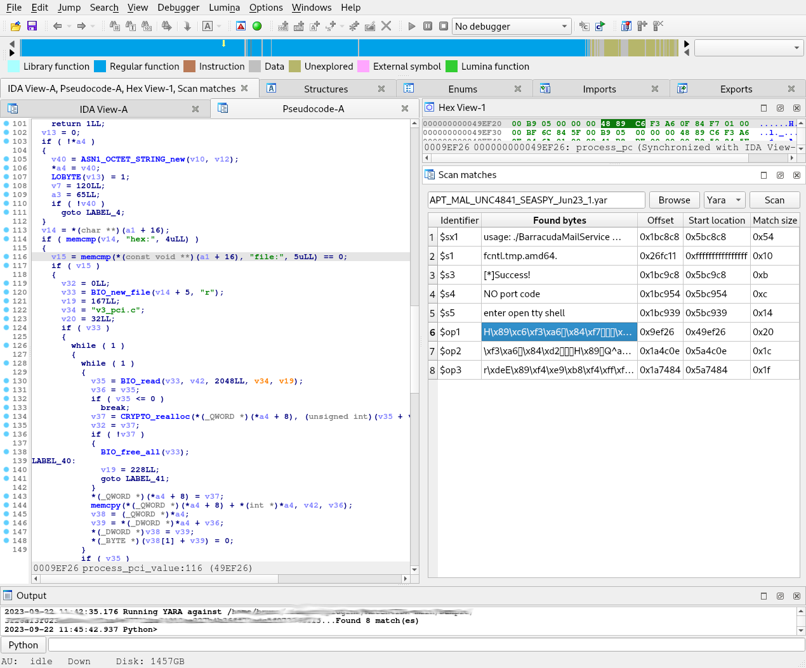
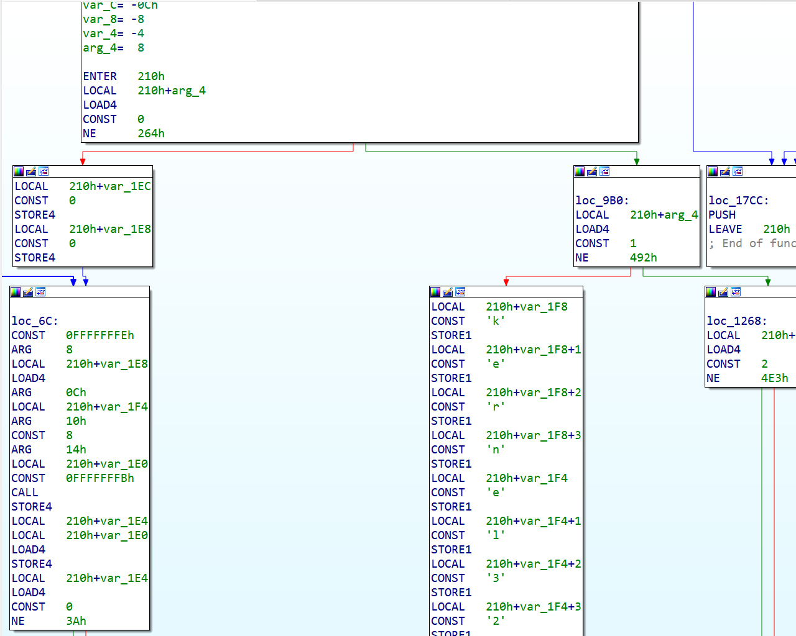
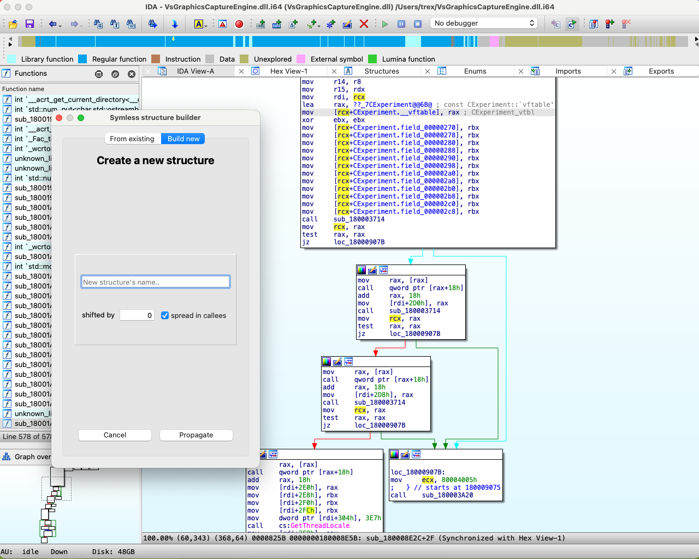
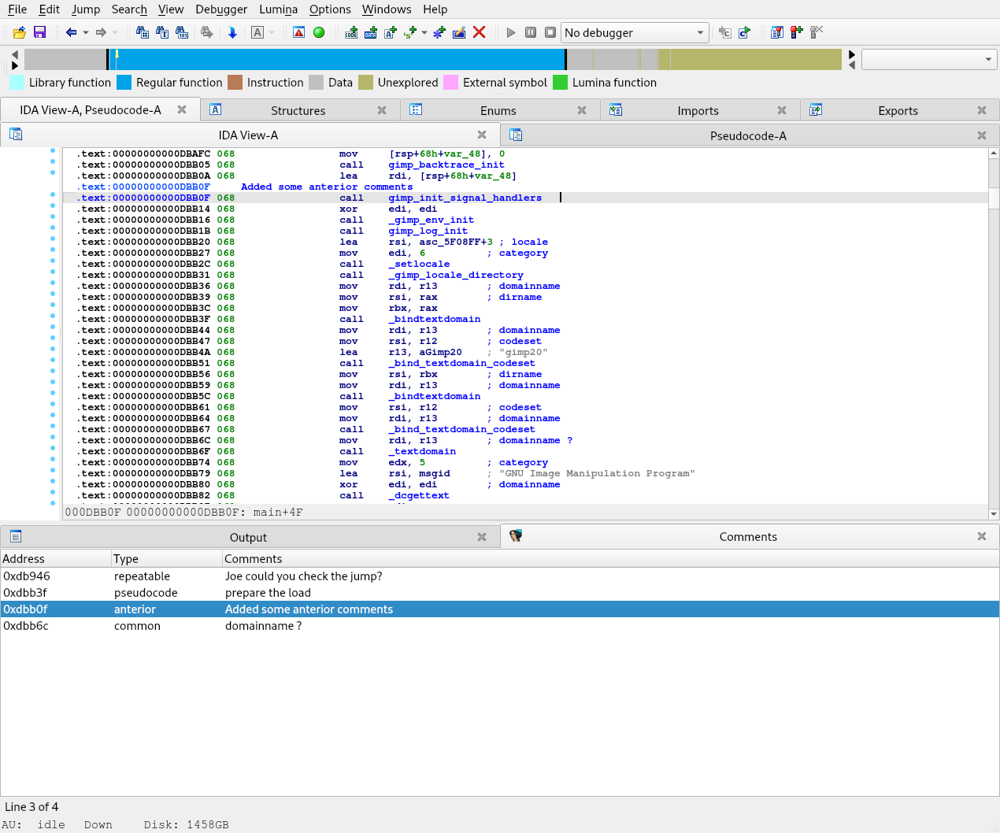

# 2023 Plug-In Contest

We received nine interesting submissions this year! As usual, many thanks to all the participants for their hard work, and interesting ideas. After having analyzed and deliberated about all the submitted plugins, our panel of judges selected the following winners:

First prize: [IdaClu](#IdaClu)

Second prize: [Heimdallr](#Heimdallr)

Third prize: [Symless](#Symless)

## Full list of submissions

- [AntiDebugSeeker](#AntiDebugSeeker)
- [Gepetto](#Gepetto)
- [Heimdallr](#Heimdallr)
- [Hvcall GUI](#Hvcall_GUI)
- [IdaClu](#IdaClu)
- [Match4IDA](#Match4IDA)
- [quakevm](#quakevm)
- [Symless](#Symless)
- [UserComment](#UserComment)

## AntiDebugSeeker

- Takahiro Takeda (LAC)
- [IDA_Plugin_AntiDebugSeeker.zip](PlugIn/IDA_Plugin_AntiDebugSeeker.zip)
- https://github.com/LAC-Japan/IDA_Plugin_AntiDebugSeeker

> This is a program for automatically extracting anti-debugging techniques used by malware and displaying them in IDA.

**Our opinion:**  
AntiDebugSeeker determines common anti-debugging techniques used in PE files. We liked that it is based purely on static analysis and does not require spawning a debugger. With regard to the detected patterns it covers the "classics" but also some rather new anti-debugging tricks. IDA can quickly jump to the detected patterns by double-clicking results displayed in the plugin's user interface. The plugin is configurable to search for other / additional keywords.

## Gepetto

- Ivan Kwiatkowski
- [Gepetto-main.zip](PlugIn/Gepetto-main.zip)
- https://github.com/JusticeRage/Gepetto

> Gepetto is a Python script which uses OpenAI's gpt-3.5-turbo and gpt-4 models to provide meaning to functions decompiled by IDA Pro. At the moment, it can ask gpt-3.5-turbo to explain what a function does, and to automatically rename its variables.

**Our opinion:**  
Gepetto is a plugin that consults ChatGPT on code produced by the decompiler. It feeds the decompiler output into OpenAI's davinci-003 model and queries it for summaries and descriptive variable names. Response quality varies per function (and is not the plugin's fault), but the plugin availability nudged us into playing with the decompiler-ai-interface idea and we were able to obtain some impressive results as depicted in the screenshot below.

We especially like that Gepetto is straightforward to use. As it is the case for all OpenAI-interfacing plugins, the user has to bring their own OpenAI API key.

## Heimdallr

- RobertNotRob (Interrupt Labs)
- [heimdallr-client-main.zip](PlugIn/heimdallr-client-main.zip)
- [heimdallr-ida-main.zip](PlugIn/heimdallr-ida-main.zip)
- https://github.com/interruptlabs/heimdallr-ida

> The Heimdallr IDA plugin exposes a localhost gRPC server for each IDA instances which allows the Heimdallr client to navigate to locations in IDA.

**Our opinion:**  
Heimdallr provides a simple though very powerful feature: creating URIs from addresses in an idb which can then be opened through a handler installed on the user's system. The links created through a shortcut can then be pasted anywhere: notes, memos, emails etc. So long as the appropriate IDB is available on a machine, Heimdallr lets the user open links to it.

Currently macOS only.

## Hvcall GUI

- Arthur "gerhart_x" Khudyaev
- [HvCallGui.zip](PlugIn/HvCallGui.zip)
- https://github.com/gerhart01/Hyper-V-Tools/tree/main/Extract.Hvcalls 

> ... C# utility for automatically extraction of Hyper-V hypercalls names and codes from Hyper-V core binaries

**Our opinion:**  
The submission includes a Python script which uses the decompiler to find hypercall values for each exported function and writes the result to a JSON file. The .NET GUI can be used to automate running IDA on multiple files using hypercalls and combine the results.  
This tool will definitely be useful for research on Microsoft Windows' hypervisor.

## IdaClu

- Sergejs Harlamovs (IKARUS Security Software GmbH)
- [IdaClu-master.zip](PlugIn/IdaClu-master.zip)
- https://github.com/harlamism/IdaClu

> **IdaClu** is an **IDA Pro** plugin with a straightforward 3-step loop pipeline:
>
> 1. Find similarities in functions;
> 2. Label grouped functions together;
> 3. Repeat step 1 for labeled functions.

**Our opinion:**  
IdaClu is a plugin that creates an environment for (IDAPython) sub-plugins to process and report information about functions.  
The plugin presents a polished widget that lets the user trigger sub-plugins (analyses) and inspect their results over a set of functions via a table view. It comes prepackaged with 18 sub-plugins to gather information on function similarity, control flow patterns, common constants and more.  
IdaClu is built for users to write more sub-plugins for it through a simple interface. It also provides backwards compatibility for older IDAPython scripts.

## Match4IDA

- Cyrille BAGARD
- [Match4IDA-main.zip](PlugIn/Match4IDA-main.zip)
- https://github.com/riskeco/Match4IDA

> On a malware analysis matter, reverse engineering can initially be fed by detection rules. These rules may be specific or generic, public or private, and a quick check or an extra analysis may be required when an alert is triggered.  
> Scanners usually provide the offsets of the patterns found inside the analyzed sample.  
> IDA is able to jump to such file offsets, but linear addresses are the more preferred way in the software to change the current location. As converting offsets to addresses may involve basic boring steps, this kind of computing is suitable for a Python script!  
> This is the aim of the match4ida plugin.

**Our opinion:**  
Match4Ida is a python plugin offering an interface to run rules on a binary:

- Integrates with the python library of YARA and ROST;
- Presents the result of the analysis in one view;
- Allows to jump directly in the disasembly listing or the pseudo code from the result view;
- Allows to runs against another set of rule on the same binary without closing Ida.

This plugin helps and speeds up the analysis of malware inside Ida.

## quakevm

- David Catalán from KrakenLabs of Outpost24
- [quakevm_contest_sub.zip](PlugIn/quakevm_contest_sub.zip)

> ... loader and processor modules for the Quake 3 Virtual Machine ([https://github.com/jnz/q3vm](https://github.com/jnz/q3vm)) used in the videogame and the Rhadamanthys malware. The modules are C++ coded and add support for QVM binaries, parsing its headers, "decompressing" its code and disassembling it, allowing to work comfortably with these files by using IDA's features.

**Our opinion:**  
The loader and the processor module work nicely to disassemble qvm scripts. Most of the standard features are supported: functions, cross-references, stack variables. This entry will definitely be useful for researchers working with qvm scripts.

## Symless

Thalium team
- [symless-main.zip](PlugIn/symless-main.zip)
- https://github.com/thalium/symless

> Automatic structures recovering plugin for IDA. Able to reconstruct structures/classes and virtual tables used in a binary.

**Our opinion:**  
The symless plugin recovers structure layouts through code analysis.  
It provides an action that will recover a type starting from a register containing a pointer to a structure, then it will propagate the recovered type to operands and function types.  
The plugin supports Windows x64 (`__fastcall`), Windows i386 (`__stdcall` & `__thiscall`), System V x64 (`__fastcall`) and System V i386 (`__stdcall`).  
It can also be run as a script to pre-analyze an entire file.

## UserComment

- JayRE
- [UserComment.zip](PlugIn/UserComment.zip)
- https://github.com/JayRE114514/UserComment

> UserComment is an IDA pro plugin to display user-added comments in disassembly and pseudocode views.

**Our opinion:**  
UserComment is a python plugin that shows in one view all users comments and offers:

- Gathering user comments as the user types it;
- Direct jump to the address of the comment, in the pseudo code or diasembly listing;
- Keeping gathered comments in the idb.

These plugin ease the information sharing when you works on the same database as you collegues as well a centralized place to find your notes.

